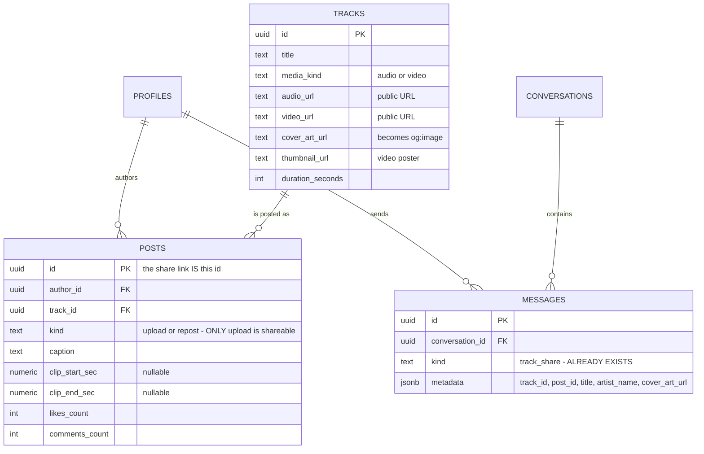
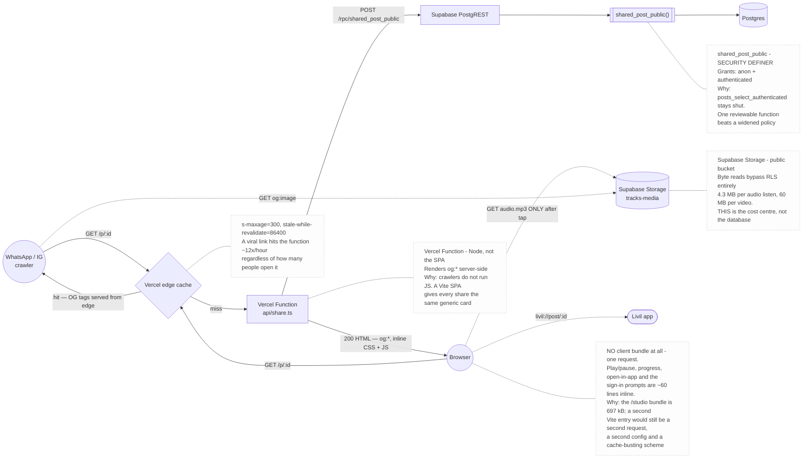
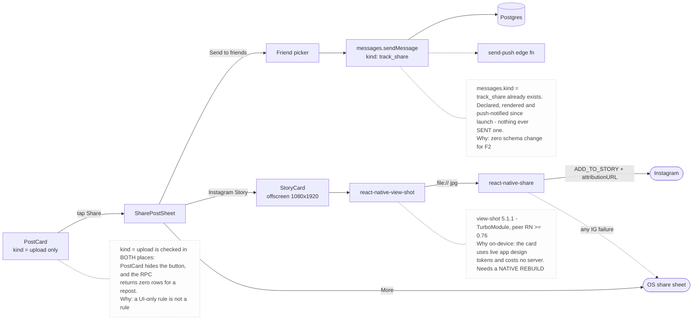
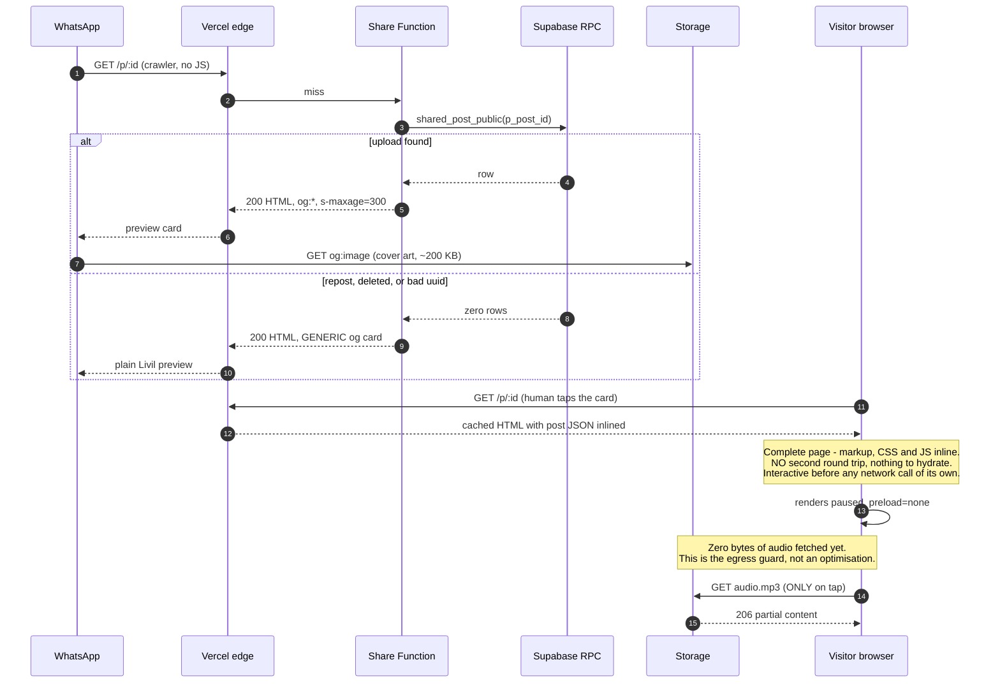

# Design: Post Sharing

> **In one line:** Sharing is not a feature of the mobile app — it is a **second, anonymous
> read surface** on a database whose every post row is currently gated behind
> `to authenticated`. That single fact, not the share sheet, is the design.

**Assumptions:** Only `kind = 'upload'` posts are shareable — a repost is someone else's
share already. A shared link is public to anyone holding it; there is no per-post privacy
toggle in v1. Android only, matching [ADR-0005](../decisions/0005-ios-platform-status.md).

| | |
|---|---|
| **Scale** | Low request volume; **egress-bound**, not QPS-bound |
| **Primary constraint** | Supabase Storage egress per anonymous listen — one viral post is a bill, not an outage |
| **Key decision** | Server-render the link page as a Vercel Function; keep post rows closed and open a single narrow `security definer` read |

---

## §1. Functional Requirements

> **Summary:** One Share button on upload posts, three destinations, and a public page that
> plays the track for someone who has never heard of Livil.

| # | Requirement | Priority |
|---|---|---|
| F1 | A viewer taps Share on an **upload** post and picks a destination | Must |
| F2 | Share to one or more **Livil friends** as a DM that renders as a playable track card | Must |
| F3 | Share to **any external app** (WhatsApp, Telegram, Messages, IG DM) as a link | Must |
| F4 | Share to **Instagram Stories** as a rendered image card with a link back | Must |
| F5 | A logged-out visitor opens the link in a browser and **plays the track** | Must |
| F6 | The link renders a **rich preview** (art, title, artist) when pasted into a chat | Must |
| F7 | Any authenticated action on the page (like, comment, follow) **prompts to open the app** | Must |
| F8 | If Livil is installed, the link **opens the app** on that post instead of the browser | Should |

**Out of scope for v1:** share counts and per-link attribution analytics; sharing profiles,
albums, playlists or stories; short codes; a per-post "private / unlisted" toggle; signing in
on the share page; iOS.

> **Out loud —** *"F7 is the one that looks like a UI detail and isn't. The moment a logged-out
> visitor can like something, I need anonymous write paths, abuse controls, and a moderation
> story on a surface with no account behind it. Pushing every write into the app keeps the
> entire public surface **read-only**, which is what lets me ship this with one new database
> function instead of a threat model."*

---

## §2. Non-Functional Requirements

> **Summary:** Nothing here is throughput-constrained. The numbers that shape the design are
> **bytes per listen** and **crawler behaviour**, not queries per second.

| # | Requirement | Target | Why it shapes the design |
|---|---|---|---|
| N1 | Share-page first paint | p99 < 1.5 s on 4G | Rules out shipping the 697 kB `/studio` bundle — and, as built, any bundle: the page is one self-contained response |
| N2 | Preview tag availability | 100%, no JavaScript | WhatsApp/Instagram/Twitter crawlers **do not run JS** — forces server rendering |
| N3 | Anonymous read scope | Exactly one post, by id | No listing, no enumeration, no adjacent data |
| N4 | Post-row confidentiality | Unchanged for every other read path | `posts_select_authenticated` must survive untouched |
| N5 | Share-sheet open latency | p99 < 400 ms for link; < 2.5 s for Story card | Card capture is on-device and synchronous — needs a spinner and a fallback |
| N6 | Deleted-post handling | Graceful 200, never 500 | A dead link in someone's WhatsApp history is permanent; it must land somewhere sane |
| N7 | Egress per anonymous listen | Budgeted, see below | The only line with real money attached |

### Capacity estimation

```
REQUEST VOLUME — the part that does not matter
  shared_post_public RPC   1 call per page load
  10,000 opens of one link = 10,000 calls, spread over days
                           ≈ well under 1 QPS sustained
                             ⇒ Postgres is not a consideration here at all

EGRESS — the part that does
  audio  3 min @ 192 kbps  = 192,000 b/s × 180 s ÷ 8 = 4.3 MB per full listen
  video  3 min @ 1080p     ≈ 60 MB per full listen

  10,000 opens, audio      = 43 GB
  10,000 opens, video      = 600 GB

  Supabase Micro included  = 250 GB/month
  overage                  ≈ $0.09/GB
     10k audio opens       = free (17% of the monthly allowance)
     10k video opens       = 350 GB over = ~$32 for ONE post

PROGRESSIVE DOWNLOAD, NOT STREAMING (media-pipeline.md)
  There is no HLS and no adaptive bitrate. A listener who plays 10 seconds of a
  4-minute track and leaves still pulls whatever the browser prefetched.
     ⇒ preload="none" is load-bearing, not a nicety

STORY CARD
  1080 × 1920 PNG          ≈ 2.1 MB   → Instagram cap is 8 MB, fits
  1080 × 1920 JPEG q0.9    ≈ 0.4 MB   → chosen; 5× smaller, no visible loss on a photo card
```

**What the math decided:** `preload="none"` on the media element, tap-to-play rather than
autoplay, and video share pages that lead with the poster image rather than the video.

> **Out loud —** *"The interesting number here is the one nobody asks for. Request volume is
> nothing — this app could serve a hundred thousand share-page loads on the free tier without
> noticing. But because there's no adaptive streaming, every listen is a full-file download,
> and one video post doing modestly well is thirty dollars. So the thing I'm optimising isn't
> latency or QPS, it's **bytes per curious stranger**. That's why the page opens paused."*

> **Out loud —** *"And here's the accidental gift: browsers block autoplay-with-sound. So the
> platform is already rate-limiting my egress for me — a visitor has to actually tap play
> before I pay for a single byte. I'd be tempted to autoplay muted video for the vibe, and I'm
> deliberately not, because muted autoplay still downloads the file."*

---

## §3. Data Model

> **Summary:** **No new tables.** One new `security definer` function, and a DM message kind
> that already exists and is already rendered.



| Object | Store | Change | Why |
|---|---|---|---|
| `posts`, `tracks`, `profiles` | Postgres | **None** | Everything the page renders is already there |
| `messages.kind = 'track_share'` | Postgres | **None** | Declared in `src/services/messages.ts:245`, rendered in `ConversationScreen.tsx:188`, push-notified in `messages.ts:62`. Nothing ever sent one |
| `public.shared_post_public(uuid)` | Postgres function | **New** | The entire anonymous read surface, in one place |

**No `share_links` table, and no short codes.** The share URL is the raw post uuid:
`https://livil-music.com/p/8f14e45f-ceea-4d1a-9c0f-1f2a3b4c5d6e`. A uuid v4 is 122 bits of
entropy, so the id is its own capability — enumeration is not a threat that needs designing
against. Short codes would buy a prettier link and a natural home for per-link attribution,
and cost a table, a write path, and collision handling on day one.

> **Out loud —** *"I want to be honest that the uuid link is uglier than `livil.to/aB3xY9z`.
> I'm taking it anyway because the pretty version is a table, an insert path, a collision
> retry and a second lookup on the hot path — for a cosmetic win on a string that WhatsApp
> renders as a card and hides anyway. The moment someone needs to say a link out loud, or we
> want to know which share drove which listen, that's the trade flipping and I'd add the table
> then."*

### The one existing invariant this must not touch

`posts_select_authenticated` (baseline schema, line 304) grants post reads `to authenticated`
only. **It stays exactly as it is.** The anonymous surface is a `security definer` function,
which is the same shape every other privileged read in this repo already uses
(`profile_tab_counts`, `activity_record_play`) — and it is the shape the `anon`-grant sweep in
`20260806040000_revoke_stale_anon_function_grants.sql` was written to make reviewable.

---

## §4. API List

> **Summary:** One new database function, one new HTTP route, one new native bridge. No
> service tier — [ADR-0004](../decisions/0004-supabase-direct-no-api-tier.md) holds.

| Method | Path / Symbol | Purpose | Auth | Idempotent |
|---|---|---|---|---|
| `POST` | `/rest/v1/rpc/shared_post_public` | Fetch one upload for public display | **`anon`** + `authenticated` | Yes |
| `GET` | `livil-music.com/p/:postId` | Server-rendered share page | None | Yes |
| `GET` | `livil-music.com/.well-known/assetlinks.json` | Android App Links proof | None | Yes |
| — | `livil://post/:postId` | Deep link into the app | Session | Yes |
| — | `sharePostLink(post)` | Build URL, open OS share sheet | Session | Yes |
| — | `sharePostToStory(post)` | Capture card, fire ADD_TO_STORY | Session | Yes |
| — | `shareToConversations(post, ids[])` | Send `track_share` DMs | Session | **No** — see below |

**`shareToConversations` is deliberately not idempotent.** Sending the same track to the same
friend twice is a thing people *do*, so there is no natural key to dedupe on and an
idempotency key would suppress a legitimate second send. The button disables itself while the
send is in flight; that is the whole concurrency control, and it is enough for a chat message.

---

## §5. API Contracts

> **Summary:** The RPC contract is where the security review happens — what it returns is
> exactly what becomes public.

### `POST /rest/v1/rpc/shared_post_public` — the anonymous read

**Request**
```json
{ "p_post_id": "8f14e45f-ceea-4d1a-9c0f-1f2a3b4c5d6e" }
```

**Response `200`** — a single row, or **zero rows** for anything not publicly shareable.
```json
{
  "post_id": "8f14e45f-ceea-4d1a-9c0f-1f2a3b4c5d6e",
  "caption": "made this at 4am",
  "created_at": "2026-08-28T04:11:00Z",
  "likes_count": 42,
  "comments_count": 7,
  "clip_start_sec": null,
  "clip_end_sec": null,
  "author_username": "riya",
  "author_display_name": "Riya",
  "author_avatar_url": "https://…/avatars/…/avatar.jpg",
  "track_title": "Neon Rain",
  "track_media_kind": "audio",
  "track_audio_url": "https://…/tracks-media/…/audio.mp3",
  "track_video_url": null,
  "track_cover_art_url": "https://…/tracks-media/…/cover.jpg",
  "track_thumbnail_url": null,
  "track_duration_seconds": 214
}
```

| Guard | Behaviour | Why |
|---|---|---|
| `kind <> 'upload'` | Zero rows | **This is where "uploads only" is enforced.** A UI-only rule is not a rule |
| Post deleted | Zero rows | N6 — the page renders a tombstone, not a 500 |
| Any other field | Not returned | `waveform_peaks`, lyrics, comments, collaborator rows, `views_count`, viewer state |

**Not returned, on purpose:** `views_count`. Likes and comments are social proof a stranger
should see; play count is business intelligence about an artist, handed to anyone with a link.

> **Out loud —** *"The temptation with a function like this is `select *` and let the page pick.
> I'm listing columns instead, because the return type of this function is a **published API
> contract with the entire internet**, and the day someone adds a private column to `posts`,
> `select *` publishes it. Enumerating columns means that change is a no-op instead of an
> incident."*

### `GET livil-music.com/p/:postId` — the share page

**Response `200`** — HTML, always 200 even for a dead post (N6).

```html
<meta property="og:title"       content="Neon Rain — Riya">
<meta property="og:description" content="made this at 4am · Listen on Livil">
<meta property="og:image"       content="https://…/cover.jpg">
<meta property="og:type"        content="music.song">
<meta property="og:audio"       content="https://…/audio.mp3">
<meta name="twitter:card"       content="summary_large_image">
<script type="application/json" id="__LIVIL_POST__">{ …the RPC row… }</script>
```

| Status | Condition | Body |
|---|---|---|
| `200` | Found | Page with OG tags + hydrated player |
| `200` | Deleted / repost / bad uuid | Generic Livil OG card + "This post isn't available" + install CTA |
| `500` | Supabase unreachable | Generic OG card, retry copy — **never a stack trace** |

**The embedded JSON is the idempotency trick.** The function already fetched the row to build
the meta tags, so it inlines it. The client never re-requests it: one round trip, no loading
spinner, and the page is correct with JavaScript disabled down to the play button.

### `sharePostToStory(post)` — Instagram Stories

```ts
// 1. Render <StoryCard/> offscreen at 1080×1920, capture to a JPEG file
const uri = await captureRef(cardRef, { format: 'jpg', quality: 0.9, result: 'tmpfile' });

// 2. Hand it to Instagram with a link back
await Share.shareSingle({
  social: Share.Social.INSTAGRAM_STORIES,
  appId: FACEBOOK_APP_ID,            // required by Instagram — see §8
  backgroundImage: uri,
  attributionURL: `https://livil-music.com/p/${post.id}`,
});
```

| Failure | Fallback |
|---|---|
| Instagram not installed | Generic share sheet with the link |
| Capture fails (OOM, view not laid out) | Generic share sheet with the link, toast: "Couldn't make the card" |
| `appId` missing/rejected | Generic share sheet with the link |

**Every Instagram failure degrades to F3**, which always works. The Story path is an
enhancement over the link, never a replacement for it.

---

## §6. Architecture

> **Summary:** Two paths that never meet. The anonymous path terminates at one database
> function; the in-app path never leaves the phone except to write a chat message.

### Public Read Path — `GET /p/:id`, crawler previews, media playback



*Dashed = deferred or off the critical path. Note that the only solid line touching Storage is
the crawler fetching `og:image` — the visitor's media request is dashed because it does not
happen until a human taps play. That dash is the egress budget.*

### In-App Share Path — DM, Story card, external link



| Component | Why it exists | What if removed |
|---|---|---|
| Vercel Function | Server-renders OG tags | Every shared link previews as a blank Livil card (N2) |
| Inline CSS + JS, no bundle | One request, nothing to hydrate | A second bundle to fetch, build and cache-bust for behaviour that fits in 60 lines |
| `shared_post_public` | The only anonymous read | Alternative is widening `posts_select_authenticated` to `anon` — publishes every post row including reposts |
| Edge cache | Collapses crawler + human traffic | Every WhatsApp forward re-runs the function |
| `react-native-view-shot` | Turns a React view into a JPEG | No Story card; F4 drops to a link |
| `react-native-share` | The only way to attach a **file** to an Android share intent | RN's built-in `Share` sends text only — F4 is unreachable |

> **Out loud —** *"People assume RN's built-in Share API can do this. It can't — on Android it
> sends text and a URL, full stop. There is no file attachment. So the moment the requirement
> says 'Instagram Story', you've committed to a native module and a rebuild, and that's worth
> saying out loud before anyone budgets this as a UI ticket."*

---

## §7. Request Flows

### Someone opens a shared link — the interesting ordering



*Read step 4 and step 11 together: the crawler and the human both hit the edge, and the human's
page is fully rendered before it has made a single request of its own. The only uncached byte
either of them costs us is the cover art — until someone actually decides to listen.*

### Sharing to Instagram Stories, including the branch that usually fires

```mermaid
sequenceDiagram
    autonumber
    participant U as User
    participant SS as SharePostSheet
    participant C as StoryCard (offscreen)
    participant VS as view-shot
    participant RS as react-native-share
    participant IG as Instagram

    U->>SS: tap "Instagram Story"
    SS->>C: mount offscreen at 1080x1920
    Note over C: Cover art must be DECODED before capture.<br/>Capturing early yields a card with a grey hole<br/>where the artwork should be.
    C-->>SS: onLoad of cover image
    SS->>VS: captureRef(quality 0.9, tmpfile)
    alt capture ok
        VS-->>SS: file:///.../story.jpg
        SS->>RS: shareSingle(INSTAGRAM_STORIES, appId, attributionURL)
        alt Instagram installed and appId accepted
            RS->>IG: ADD_TO_STORY intent
            IG-->>U: story composer, card preloaded
        else not installed or appId rejected
            RS-->>SS: throw
            SS->>RS: fall back - generic sheet with link
        end
    else capture failed
        VS-->>SS: throw
        SS->>RS: fall back - generic sheet with link
        Note over SS: Toast: could not make the card.<br/>The share still happens.
    end
```



*The `onLoad` wait in step 3 is the step everyone omits. `captureRef` fires synchronously
against whatever is painted, so capturing before the remote cover art decodes produces a
perfectly rendered card with a hole in it — and it only reproduces on a cold image cache,
which is exactly never on the developer's own phone.*

---

## §8. Tradeoffs & Bottlenecks

### Decisions

| Decision | Rejected alternative | What would flip it |
|---|---|---|
| **`security definer` RPC** for anonymous reads | Widen `posts_select_authenticated` to `anon` | Never. The policy is a blanket `using (true)` — adding `anon` publishes every post row, reposts included, to an unauthenticated `select *` |
| **Vercel Function** renders the page | Client-side route in the existing SPA | Only if crawlers started running JavaScript. They don't, and won't |
| **No client bundle — inline CSS and JS** | A second Vite entry hydrating the page (the original plan), or reusing `/studio` | When the page needs real app state — a queue, a comment thread, sign-in. `/studio` is 697 kB and was never a candidate; the *second entry* was, and it lost because everything the page does fits in ~60 lines against a native `<audio>`, so the bundle bought a second request, a second Vite config and a cache-busting scheme for nothing |
| **Raw post uuid** in the URL | `share_links` table with base62 codes | The first time we need per-link attribution, or someone has to read a link aloud |
| **`cover_art_url` as `og:image`** | `@vercel/og` composing a branded 1200×630 card | When link previews become a growth channel worth a dependency and a render budget. It is a self-contained upgrade — one function, no schema |
| **On-device Story card** | Server-rendered card image | If Android capture proves unreliable across the device matrix, or iOS needs parity without a second implementation |
| **`react-native-share`** | Bespoke Kotlin module firing the intents | A bespoke module is ~150 lines and zero dependencies, but the FileProvider config, Android 11 package-visibility `<queries>` and the Instagram extras are all things a maintained library has already got wrong once and fixed. **The maintainer is a front-end developer — a library they can upgrade beats native code they cannot debug** |
| **No anonymous play counting** | Count share-page listens into `views_count` | Requires an anonymous write path with no rate-limit key (no `auth.uid()`, no reliable IP in Postgres). `views_count` stays "plays by Livil users", which is at least a definition |
| **Read-only public surface** | Sign in on the web page and like there | If web sign-ups from shared links become a measurable acquisition channel — the same argument that reversed decision 3 of [ADR-0015](../decisions/0015-web-creator-dashboard.md) |

> **Out loud —** *"The rejected alternative I want to be loudest about is widening the RLS
> policy. It's a one-line migration and it would work today, and it is exactly the change
> that's impossible to un-ship — the moment `anon` can `select` from `posts`, someone is
> scraping the table and I have no idea. The function gives me the same product outcome with a
> reviewable diff, and if it turns out to leak something, I fix one function instead of
> auditing every consumer of a policy."*

### What breaks first at 10×

| Order | Component | Breaks at | Fix |
|---|---|---|---|
| 1 | **Supabase Storage egress** | ~250 GB/month included; **one video post at 4k opens** | Put a CDN in front of the bucket, or transcode a low-bitrate web preview |
| 2 | Cold-start on the share function | Noticeable at low traffic — a rarely-hit function is *always* cold | `s-maxage=300` means the first visitor pays, the next 300 seconds don't |
| 3 | Vercel function invocations | 100k/month on Hobby | Edge cache already collapses this ~50× for a viral link |
| 4 | `shared_post_public` QPS | Nowhere near a limit | Not a real entry; listed so nobody optimises it by mistake |

**The first failure is a bill, not an outage** — and it arrives from a *single* successful post,
not from growth. Ten thousand people opening one video link costs more than the entire rest of
the platform for that month. The mitigation is already in the design (`preload="none"`,
tap-to-play, poster-first video), and the escape hatch is a CDN in front of Storage.

> **Out loud —** *"If you push me on what actually goes wrong here, it isn't scale — this app
> will not have a throughput problem for years. It's that sharing is the first feature whose
> **cost is unbounded by our user count**. Every other byte we serve goes to someone who
> installed the app. A share link goes to strangers, and there is no ceiling on strangers.
> That's a genuinely new shape of risk for this system and it deserves a billing alert on day
> one, not after the invoice."*

### Failure modes

| Failure | Effect | Degradation | Blast radius |
|---|---|---|---|
| Supabase down | Function can't fetch the row | Generic Livil preview + install CTA; **no 500** | Share pages only; app unaffected |
| Post deleted after sharing | Zero rows | Tombstone page + install CTA (N6) | One link |
| Vercel down | Links dead | `livil://` deep links still open the app for people who have it | Public surface only |
| Instagram not installed | `shareSingle` throws | Generic share sheet with the link | One share action |
| `view-shot` capture fails | No card | Generic share sheet with the link + toast | One share action |
| App Links unverified (no `assetlinks.json`) | `https` link opens the browser, not the app | The page's "Open in app" button uses `livil://`, which **needs no verification** | Cosmetic — one extra tap |
| Cover art missing | No `og:image` | Gradient fallback card; preview shows title text only | Cosmetic |

**The App Links row is the one to notice.** Verification depends on a file only the maintainer
can produce (it needs the Play App Signing fingerprint), so the design assumes it is missing
and still works. The custom scheme is the load-bearing path; App Links are the polish.

### Cost shape

```
Storage egress (Supabase, beyond 250 GB included)   $0.09 / GB
  one 3-min audio post, 10k opens        43 GB   →  free (within allowance)
  one 3-min video post, 10k opens       600 GB   →  350 GB over  ≈ $32
  same video behind a CDN @ ~80% hit    120 GB   →  free

Vercel Functions (Hobby)              100k invocations / month included
  one viral link, 10k opens, s-maxage=300 over 2 days
                                       ≈ 576 invocations   →  0.6% of allowance

Story card render                      on-device            →  $0
OG image                               existing cover art   →  $0 extra
```

**The whole cost of this feature is media egress, and a CDN in front of `tracks-media` is the
single lever.** Everything else rounds to zero. That also reframes the R2 rejection in
ADR-0015: R2 was rejected partly because Supabase Storage speaks TUS natively for *uploads* —
but R2's zero-egress pricing is a *download*-side argument that sharing is the first feature to
actually make.

---

## §9. Gap Analysis — design vs. what exists today

> **Summary:** The database and the DM path need almost nothing. The public surface does not
> exist at all, and the native share capability is genuinely absent.

| Capability | Today | Gap | Severity |
|---|---|---|---|
| `track_share` DM message | Type declared (`messages.ts:245`), bubble rendered (`ConversationScreen.tsx:188`), push wired (`messages.ts:62`) | **Nothing ever sends one.** Needs a sheet, a friend picker, one service function | Low — plumbing exists |
| Anonymous post read | `posts_select_authenticated` blocks `anon` entirely | Needs `shared_post_public` | **Blocking** |
| Public media bytes | Buckets are `public`; byte reads bypass RLS (verified by probe in `20260804010000`) | **None** — already works | — |
| Share page | `web/` is a signed-in dashboard at `/studio`; the apex is static marketing | Needs a Vercel Function and a `vercel.json` route. **No second Vite entry** — see §8 | **Blocking** |
| OG tags | None anywhere | Needs server rendering | **Blocking for F6** |
| Deep links | `livil://` scheme registered in `AndroidManifest.xml`; handler in `RootNavigator.tsx:270` **only accepts `livil://auth`** and returns early otherwise | Needs a `post` route in the handler; App Links filter + `assetlinks.json` for F8 | Medium |
| File sharing from the app | `Share.share({message})` used in `SettingsScreen.tsx:100` and `ProfileScreen.tsx:661` — **text only** | Needs `react-native-share` + `react-native-view-shot` and a **native rebuild** | **Blocking for F4** |
| Share button on posts | No Share affordance on `PostCard` at all | New sheet + entry points on card, player and detail view | Blocking |

**Two gaps are worth defending rather than fixing.** `views_count` not counting anonymous
listens is a definition, not a bug. And `docs/` being static marketing served through
`copy-marketing.mjs` is exactly why the share page belongs in the Vercel build and not in
`docs/` — a page that must hit the database cannot be a file in a static folder.

---

## The fork not taken

Making shared posts **unlisted by default with an explicit "make public" toggle**. It is the
more conservative product, and it is what a platform with a harassment problem eventually
needs. It was not taken because uploads are already readable by every Livil account and their
media is already public by URL, so a toggle would guard a door that is open on the other side.
Adding it later is a column and a predicate in one function — which is a further reason to
keep the anonymous surface inside a function rather than inside a policy.
