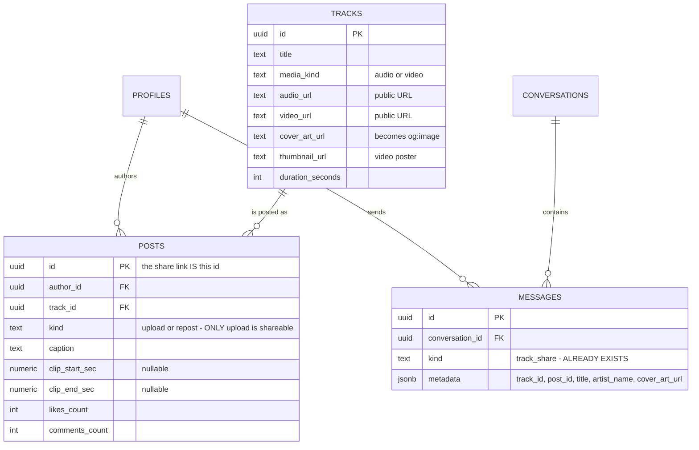
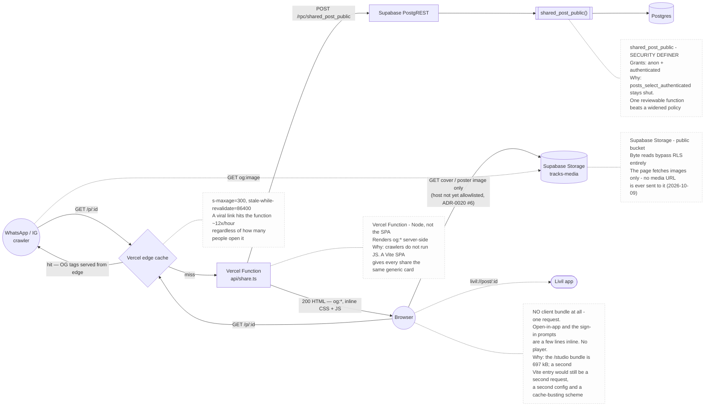
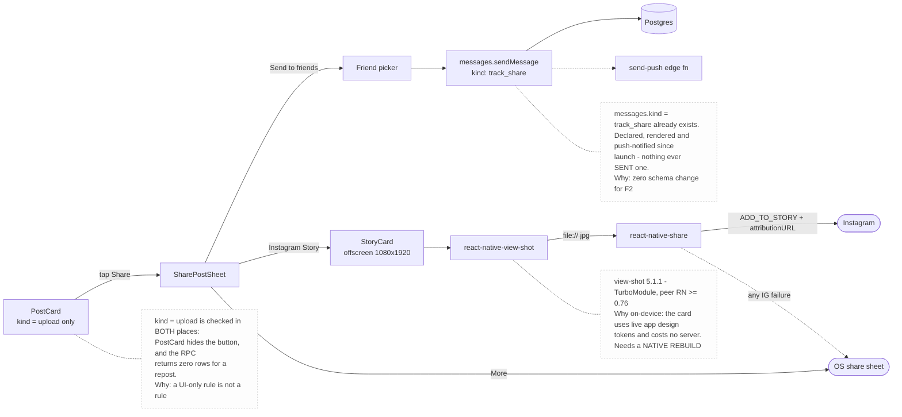
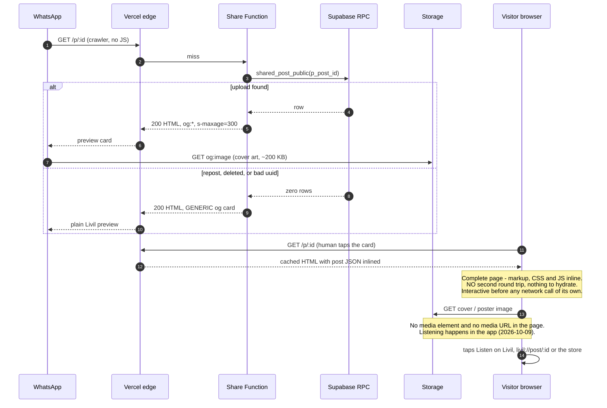
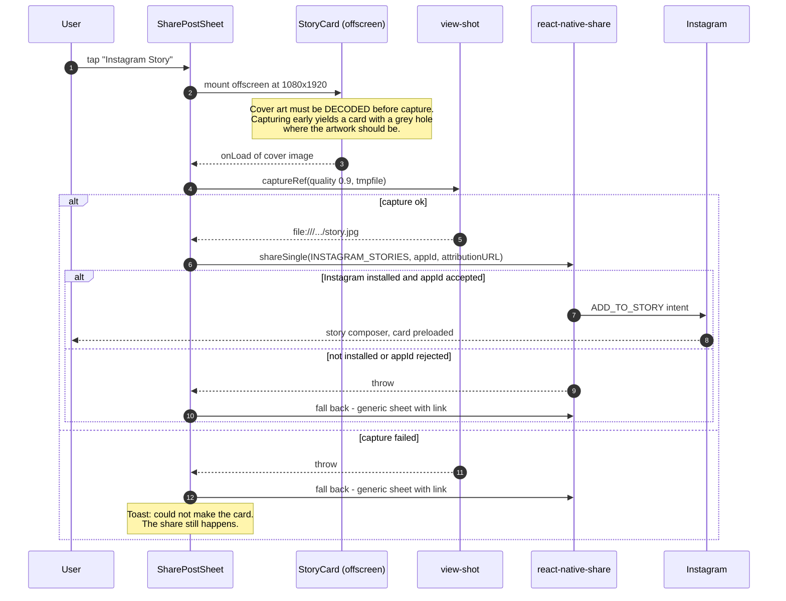

# Design: Post Sharing

> **In one line:** Sharing is not a feature of the mobile app — it is a **second, anonymous
> read surface** on a database whose every post row is currently gated behind
> `to authenticated`. That single fact, not the share sheet, is the design.

**Assumptions:** Only `kind = 'upload'` posts are shareable — a repost is someone else's
share already. A shared link is public to anyone holding it; there is no per-post privacy
toggle in v1. Android only, matching [ADR-0005](../decisions/0005-ios-platform-status.md).

> **Revised 2026-10-09 — the public page no longer plays.** Owner's rule: **listening needs a
> Livil account.** A signed-out visitor sees the post's metadata (art, title, artist, caption,
> length, likes, comments) and a **Listen on Livil** button that opens the app, and nothing that
> plays. The page renders no `<audio>`/`<video>` and no `og:audio`/`og:video`, and
> `shared_post_public` returns `track_audio_url`/`track_video_url` as `NULL`
> (`20261022000000`) — hiding the button alone would have left the file's URL in the page source
> and in the anon-callable function. F5 and §5 below are updated; the egress math in §2 is kept
> as the record of why the page once opened paused, and is now moot (zero anonymous listens).
> The web creator dashboard (`/studio`) is signed-in and unaffected.

| | |
|---|---|
| **Scale** | Low request volume; **egress-bound**, not QPS-bound |
| **Primary constraint** | ~~Supabase Storage egress per anonymous listen~~ — moot since 2026-10-09: there is no anonymous listen |
| **Key decision** | Server-render the link page as a Vercel Function; keep post rows closed and open a single narrow `security definer` read |

---

## §1. Functional Requirements

> **Summary:** One Share button on upload posts, three destinations, and a public page that
> shows the track to someone who has never heard of Livil — and sends them to the app to hear it.

| # | Requirement | Priority |
|---|---|---|
| F1 | A viewer taps Share on an **upload** post and picks a destination | Must |
| F2 | Share to one or more **Livil friends** as a DM that renders as a playable track card | Must |
| F3 | Share to **any external app** (WhatsApp, Telegram, Messages, IG DM) as a link | Must |
| F4 | Share to **Instagram Stories** as a rendered image card with a link back | Must |
| F5 | A logged-out visitor opens the link in a browser and sees the post's **metadata only** — art, title, artist, caption, length, counts — with a **Listen on Livil** button. It does **not** play: listening needs an account *(revised 2026-10-09; was "plays the track")* | Must |
| F6 | The link renders a **rich preview** (art, title, artist) when pasted into a chat | Must |
| F7 | Any authenticated action on the page (like, comment, follow) **prompts to open the app** | Must |
| F8 | If Livil is installed, the link **opens the app** on that post instead of the browser | Should |

**Out of scope for v1:** share counts and per-link attribution analytics; sharing profiles,
albums, playlists or stories; short codes; a per-post "private / unlisted" toggle; signing in
on the share page; iOS.

> **Out loud —** *"F7 is the one that looks like a UI detail and isn't. The moment a logged-out
> visitor can like something, I need anonymous write paths, abuse controls, and a moderation
> story on a surface with no account behind it. Pushing every write into the app keeps the
> entire public surface **read-only**, which is what lets me ship this with one new database
> function instead of a threat model."*

---

## §2. Non-Functional Requirements

> **Summary:** Nothing here is throughput-constrained. The numbers that shape the design are
> **bytes per listen** and **crawler behaviour**, not queries per second.

| # | Requirement | Target | Why it shapes the design |
|---|---|---|---|
| N1 | Share-page first paint | p99 < 1.5 s on 4G | Rules out shipping the 697 kB `/studio` bundle — and, as built, any bundle: the page is one self-contained response |
| N2 | Preview tag availability | 100%, no JavaScript | WhatsApp/Instagram/Twitter crawlers **do not run JS** — forces server rendering |
| N3 | Anonymous read scope | Exactly one post, by id | No listing, no enumeration, no adjacent data |
| N4 | Post-row confidentiality | Unchanged for every other read path | `posts_select_authenticated` must survive untouched |
| N5 | Share-sheet open latency | p99 < 400 ms for link; < 2.5 s for Story card | Card capture is on-device and synchronous — needs a spinner and a fallback |
| N6 | Deleted-post handling | Graceful 200, never 500 | A dead link in someone's WhatsApp history is permanent; it must land somewhere sane |
| N7 | Egress per anonymous listen | **Zero** since 2026-10-09 (no anonymous playback) | Was the only line with real money attached; the math below is kept as history |

### Capacity estimation

```
REQUEST VOLUME — the part that does not matter
  shared_post_public RPC   1 call per page load
  10,000 opens of one link = 10,000 calls, spread over days
                           ≈ well under 1 QPS sustained
                             ⇒ Postgres is not a consideration here at all

EGRESS — the part that does
  audio  3 min @ 192 kbps  = 192,000 b/s × 180 s ÷ 8 = 4.3 MB per full listen
  video  3 min @ 1080p     ≈ 60 MB per full listen

  10,000 opens, audio      = 43 GB
  10,000 opens, video      = 600 GB

  Supabase Micro included  = 250 GB/month
  overage                  ≈ $0.09/GB
     10k audio opens       = free (17% of the monthly allowance)
     10k video opens       = 350 GB over = ~$32 for ONE post

PROGRESSIVE DOWNLOAD, NOT STREAMING (media-pipeline.md)
  There is no HLS and no adaptive bitrate. A listener who plays 10 seconds of a
  4-minute track and leaves still pulls whatever the browser prefetched.
     ⇒ preload="none" is load-bearing, not a nicety

STORY CARD
  1080 × 1920 PNG          ≈ 2.1 MB   → Instagram cap is 8 MB, fits
  1080 × 1920 JPEG q0.9    ≈ 0.4 MB   → chosen; 5× smaller, no visible loss on a photo card
```

**What the math decided:** `preload="none"` on the media element, tap-to-play rather than
autoplay, and video share pages that lead with the poster image rather than the video.
*(Superseded 2026-10-09: there is no media element at all now — see the revision note at the
top. A video post shows only its poster, an audio post only its cover.)*

> **Out loud —** *"The interesting number here is the one nobody asks for. Request volume is
> nothing — this app could serve a hundred thousand share-page loads on the free tier without
> noticing. But because there's no adaptive streaming, every listen is a full-file download,
> and one video post doing modestly well is thirty dollars. So the thing I'm optimising isn't
> latency or QPS, it's **bytes per curious stranger**. That's why the page opens paused."*

> **Out loud —** *"And here's the accidental gift: browsers block autoplay-with-sound. So the
> platform is already rate-limiting my egress for me — a visitor has to actually tap play
> before I pay for a single byte. I'd be tempted to autoplay muted video for the vibe, and I'm
> deliberately not, because muted autoplay still downloads the file."*

---

## §3. Data Model

> **Summary:** **No new tables.** One new `security definer` function, and a DM message kind
> that already exists and is already rendered.


```mermaid
erDiagram
    PROFILES ||--o{ POSTS : authors
    TRACKS   ||--o{ POSTS : "is posted as"
    PROFILES ||--o{ MESSAGES : sends
    CONVERSATIONS ||--o{ MESSAGES : contains

    POSTS {
        uuid id PK "the share link IS this id"
        uuid author_id FK
        uuid track_id FK
        text kind "upload or repost - ONLY upload is shareable"
        text caption
        numeric clip_start_sec "nullable"
        numeric clip_end_sec "nullable"
        int likes_count
        int comments_count
    }
    TRACKS {
        uuid id PK
        text title
        text media_kind "audio or video"
        text audio_url "public URL"
        text video_url "public URL"
        text cover_art_url "becomes og:image"
        text thumbnail_url "video poster"
        int duration_seconds
    }
    MESSAGES {
        uuid id PK
        uuid conversation_id FK
        text kind "track_share - ALREADY EXISTS"
        jsonb metadata "track_id, post_id, title, artist_name, cover_art_url"
    }
```

| Object | Store | Change | Why |
|---|---|---|---|
| `posts`, `tracks`, `profiles` | Postgres | **None** | Everything the page renders is already there |
| `messages.kind = 'track_share'` | Postgres | **None** | Declared in `src/services/messages.ts:245`, rendered in `ConversationScreen.tsx:188`, push-notified in `messages.ts:62`. Nothing ever sent one |
| `public.shared_post_public(uuid)` | Postgres function | **New** | The entire anonymous read surface, in one place |

**No `share_links` table, and no short codes.** The share URL is the raw post uuid:
`https://livil-music.com/p/8f14e45f-ceea-4d1a-9c0f-1f2a3b4c5d6e`. A uuid v4 is 122 bits of
entropy, so the id is its own capability — enumeration is not a threat that needs designing
against. Short codes would buy a prettier link and a natural home for per-link attribution,
and cost a table, a write path, and collision handling on day one.

> **Out loud —** *"I want to be honest that the uuid link is uglier than `livil.to/aB3xY9z`.
> I'm taking it anyway because the pretty version is a table, an insert path, a collision
> retry and a second lookup on the hot path — for a cosmetic win on a string that WhatsApp
> renders as a card and hides anyway. The moment someone needs to say a link out loud, or we
> want to know which share drove which listen, that's the trade flipping and I'd add the table
> then."*

### The one existing invariant this must not touch

`posts_select_authenticated` (baseline schema, line 304) grants post reads `to authenticated`
only. **It stays exactly as it is.** The anonymous surface is a `security definer` function,
which is the same shape every other privileged read in this repo already uses
(`profile_tab_counts`, `activity_record_play`) — and it is the shape the `anon`-grant sweep in
`20260806040000_revoke_stale_anon_function_grants.sql` was written to make reviewable.

---

## §4. API List

> **Summary:** One new database function, one new HTTP route, one new native bridge. No
> service tier — [ADR-0004](../decisions/0004-supabase-direct-no-api-tier.md) holds.

| Method | Path / Symbol | Purpose | Auth | Idempotent |
|---|---|---|---|---|
| `POST` | `/rest/v1/rpc/shared_post_public` | Fetch one upload for public display | **`anon`** + `authenticated` | Yes |
| `GET` | `livil-music.com/p/:postId` | Server-rendered share page | None | Yes |
| `GET` | `livil-music.com/.well-known/assetlinks.json` | Android App Links proof | None | Yes |
| — | `livil://post/:postId` | Deep link into the app | Session | Yes |
| — | `sharePostLink(post)` | Build URL, open OS share sheet | Session | Yes |
| — | `sharePostToStory(post)` | Capture card, fire ADD_TO_STORY | Session | Yes |
| — | `shareToConversations(post, ids[])` | Send `track_share` DMs | Session | **No** — see below |

**`shareToConversations` is deliberately not idempotent.** Sending the same track to the same
friend twice is a thing people *do*, so there is no natural key to dedupe on and an
idempotency key would suppress a legitimate second send. The button disables itself while the
send is in flight; that is the whole concurrency control, and it is enough for a chat message.

---

## §5. API Contracts

> **Summary:** The RPC contract is where the security review happens — what it returns is
> exactly what becomes public.

### `POST /rest/v1/rpc/shared_post_public` — the anonymous read

**Request**
```json
{ "p_post_id": "8f14e45f-ceea-4d1a-9c0f-1f2a3b4c5d6e" }
```

**Response `200`** — a single row, or **zero rows** for anything not publicly shareable.
```json
{
  "post_id": "8f14e45f-ceea-4d1a-9c0f-1f2a3b4c5d6e",
  "caption": "made this at 4am",
  "created_at": "2026-08-28T04:11:00Z",
  "likes_count": 42,
  "comments_count": 7,
  "clip_start_sec": null,
  "clip_end_sec": null,
  "author_username": "riya",
  "author_display_name": "Riya",
  "author_avatar_url": "https://…/avatars/…/avatar.jpg",
  "author_badges": ["first_100"],
  "track_title": "Neon Rain",
  "track_media_kind": "audio",
  "track_audio_url": null,
  "track_video_url": null,
  "track_cover_art_url": "https://…/tracks-media/…/cover.jpg",
  "track_thumbnail_url": null,
  "track_duration_seconds": 214
}
```

| Guard | Behaviour | Why |
|---|---|---|
| `kind <> 'upload'` | Zero rows | **This is where "uploads only" is enforced.** A UI-only rule is not a rule |
| Post deleted | Zero rows | N6 — the page renders a tombstone, not a 500 |
| Any other field | Not returned | `waveform_peaks`, lyrics, comments, collaborator rows, `views_count`, badge `ordinal`, viewer state |

**Not returned, on purpose:** `views_count`. Likes and comments are social proof a stranger
should see; play count is business intelligence about an artist, handed to anyone with a link.

**`track_audio_url` / `track_video_url` are always `NULL`** (since migration `20261022000000`,
2026-10-09). Listening needs an account, and a media URL handed to `anon` is a player for anyone
holding the public anon key. The columns stay in the return type so the change is a body swap
(`create or replace`, grants kept) rather than a drop-and-recreate; the share page is their only
reader and no longer reads them. This closes the **media half** of ADR-0020 finding 6 — the
page no longer renders an uploader-supplied URL into `<audio src>`/`og:audio` on
livil-music.com. **The image half is still open:** `safeUrl` checks only for `https:`, so
`track_cover_art_url`/`track_thumbnail_url` can still point at a host the uploader chose, and
every visitor's browser (and every chat unfurl, via `og:image`) fetches it. Fix: allow only the
storage origin in `safeUrl` for images, falling back to the generic card.

**`author_badges`** (added 2026-09-22, migration `20260922000000`) carries the badge KINDS the
author currently holds, ordered by name and never by award time — an empty array when they hold
none. The shared link is the one page people without accounts ever see, so a First 100 founder
who is marked everywhere inside the app and bare here has not really been marked. What does not
travel with it: the founder `ordinal` (all hundred are the same badge; nobody learns they were
#2 or #99), `awarded_at` (an ordinal with extra steps — sort by it and the order is back), and
revoked grants. The existing reader `badges_for_profiles` cannot serve this page: it returns
nothing when `auth.uid()` is null, which is exactly what the share page is.

> **Out loud —** *"The temptation with a function like this is `select *` and let the page pick.
> I'm listing columns instead, because the return type of this function is a **published API
> contract with the entire internet**, and the day someone adds a private column to `posts`,
> `select *` publishes it. Enumerating columns means that change is a no-op instead of an
> incident."*

### `GET livil-music.com/p/:postId` — the share page

**Response `200`** — HTML, always 200 even for a dead post (N6).

```html
<meta property="og:title"       content="Neon Rain — Riya">
<meta property="og:description" content="made this at 4am · Listen on Livil">
<meta property="og:image"       content="https://…/cover.jpg">
<meta property="og:type"        content="music.song">
<!-- no og:audio / og:video since 2026-10-09: they would publish the file's URL -->
<meta name="twitter:card"       content="summary_large_image">
<script type="application/json" id="__LIVIL_POST__">{ …the RPC row… }</script>
```

| Status | Condition | Body |
|---|---|---|
| `200` | Found | Page with OG tags + metadata + **Listen on Livil** (no player since 2026-10-09) |
| `200` | Deleted / repost / bad uuid | Generic Livil OG card + "This post isn't available" + install CTA |
| `500` | Supabase unreachable | Generic OG card, retry copy — **never a stack trace** |

**The embedded JSON is the idempotency trick.** The function already fetched the row to build
the meta tags, so it inlines it. The client never re-requests it: one round trip, no loading
spinner, and the page is correct with JavaScript disabled (only the open-in-app fallback and
the sign-in prompt need script).

### `sharePostToStory(post)` — Instagram Stories

```ts
// 1. Render <StoryCard/> offscreen at 1080×1920, capture to a JPEG file
const uri = await captureRef(cardRef, { format: 'jpg', quality: 0.9, result: 'tmpfile' });

// 2. Hand it to Instagram with a link back
await Share.shareSingle({
  social: Share.Social.INSTAGRAM_STORIES,
  appId: FACEBOOK_APP_ID,            // required by Instagram — see §8
  backgroundImage: uri,
  attributionURL: `https://livil-music.com/p/${post.id}`,
});
```

| Failure | Fallback |
|---|---|
| Instagram not installed | Generic share sheet with the link |
| Capture fails (OOM, view not laid out) | Generic share sheet with the link, toast: "Couldn't make the card" |
| `appId` missing/rejected | Generic share sheet with the link |

**Every Instagram failure degrades to F3**, which always works. The Story path is an
enhancement over the link, never a replacement for it.

---

## §6. Architecture

> **Summary:** Two paths that never meet. The anonymous path terminates at one database
> function; the in-app path never leaves the phone except to write a chat message.

### Public Read Path — `GET /p/:id`, crawler previews (no playback since 2026-10-09)


```mermaid
flowchart LR
    Crawler(("WhatsApp / IG<br/>crawler"))
    Visitor((Browser))
    VF["Vercel Function<br/>api/share.ts"]
    CDN{"Vercel edge cache"}
    PGRST["Supabase PostgREST"]
    RPC[["shared_post_public()"]]
    PG[("Postgres")]
    STOR[("Supabase Storage<br/>tracks-media")]
    APP(["Livil app"])

    Crawler -->|"GET /p/:id"| CDN
    Visitor -->|"GET /p/:id"| CDN
    CDN -->|"miss"| VF
    CDN -->|"hit — OG tags served from edge"| Crawler
    VF -->|"POST /rpc/shared_post_public"| PGRST
    PGRST --> RPC
    RPC --> PG
    VF -->|"200 HTML — og:*, inline CSS + JS"| Visitor
    Visitor -->|"GET cover / poster image only<br/>(host not yet allowlisted, ADR-0020 #6)"| STOR
    Visitor -.->|"livil://post/:id"| APP
    Crawler -.->|"GET og:image"| STOR

    nRPC["shared_post_public - SECURITY DEFINER<br/>Grants: anon + authenticated<br/>Why: posts_select_authenticated stays shut.<br/>One reviewable function beats a widened policy"]
    nVF["Vercel Function - Node, not the SPA<br/>Renders og:* server-side<br/>Why: crawlers do not run JS. A Vite SPA<br/>gives every share the same generic card"]
    nCDN["s-maxage=300, stale-while-revalidate=86400<br/>A viral link hits the function ~12x/hour<br/>regardless of how many people open it"]
    nStor["Supabase Storage - public bucket<br/>Byte reads bypass RLS entirely<br/>The page fetches images only - no media URL<br/>is ever sent to it (2026-10-09)"]
    nSPA["NO client bundle at all - one request.<br/>Open-in-app and the sign-in prompts<br/>are a few lines inline. No player.<br/>Why: the /studio bundle is 697 kB; a second<br/>Vite entry would still be a second request,<br/>a second config and a cache-busting scheme"]

    RPC -.- nRPC
    VF -.- nVF
    CDN -.- nCDN
    STOR -.- nStor
    Visitor -.- nSPA

    classDef note fill:#fdfdfd,stroke:#c8c8c8,stroke-width:1px,stroke-dasharray:3 3,color:#444,text-align:left
    class nRPC,nVF,nCDN,nStor,nSPA note
```

*Dashed = deferred or off the critical path. Since 2026-10-09 the visitor never requests media
at all — the page has no player and is never given a media URL — so the only Storage reads on
this path are images: the crawler's `og:image` and the visitor's cover or poster.*

### In-App Share Path — DM, Story card, external link


```mermaid
flowchart LR
    Card["PostCard<br/>kind = upload only"]
    Sheet["SharePostSheet"]
    Picker["Friend picker"]
    MSG["messages.sendMessage<br/>kind: track_share"]
    PG2[("Postgres")]
    PUSH["send-push edge fn"]
    Story["StoryCard<br/>offscreen 1080x1920"]
    VS["react-native-view-shot"]
    RNS["react-native-share"]
    IG(["Instagram"])
    OS(["OS share sheet"])

    Card -->|"tap Share"| Sheet
    Sheet -->|"Send to friends"| Picker
    Picker --> MSG
    MSG --> PG2
    MSG -.-> PUSH
    Sheet -->|"Instagram Story"| Story
    Story --> VS
    VS -->|"file:// jpg"| RNS
    RNS -->|"ADD_TO_STORY + attributionURL"| IG
    Sheet -->|"More"| OS
    RNS -.->|"any IG failure"| OS

    nGate["kind = upload is checked in BOTH places:<br/>PostCard hides the button, and the RPC<br/>returns zero rows for a repost.<br/>Why: a UI-only rule is not a rule"]
    nMsg["messages.kind = track_share already exists.<br/>Declared, rendered and push-notified since<br/>launch - nothing ever SENT one.<br/>Why: zero schema change for F2"]
    nVS["view-shot 5.1.1 - TurboModule, peer RN >= 0.76<br/>Why on-device: the card uses live app design<br/>tokens and costs no server. Needs a NATIVE REBUILD"]

    Card -.- nGate
    MSG -.- nMsg
    VS -.- nVS

    classDef note fill:#fdfdfd,stroke:#c8c8c8,stroke-width:1px,stroke-dasharray:3 3,color:#444,text-align:left
    class nGate,nMsg,nVS note
```

| Component | Why it exists | What if removed |
|---|---|---|
| Vercel Function | Server-renders OG tags | Every shared link previews as a blank Livil card (N2) |
| Inline CSS + JS, no bundle | One request, nothing to hydrate | A second bundle to fetch, build and cache-bust for behaviour that fits in 60 lines |
| `shared_post_public` | The only anonymous read | Alternative is widening `posts_select_authenticated` to `anon` — publishes every post row including reposts |
| Edge cache | Collapses crawler + human traffic | Every WhatsApp forward re-runs the function |
| `react-native-view-shot` | Turns a React view into a JPEG | No Story card; F4 drops to a link |
| `react-native-share` | The only way to attach a **file** to an Android share intent | RN's built-in `Share` sends text only — F4 is unreachable |

> **Out loud —** *"People assume RN's built-in Share API can do this. It can't — on Android it
> sends text and a URL, full stop. There is no file attachment. So the moment the requirement
> says 'Instagram Story', you've committed to a native module and a rebuild, and that's worth
> saying out loud before anyone budgets this as a UI ticket."*

---

## §7. Request Flows

### Someone opens a shared link — the interesting ordering


```mermaid
sequenceDiagram
    autonumber
    participant W as WhatsApp
    participant CDN as Vercel edge
    participant F as Share Function
    participant DB as Supabase RPC
    participant S as Storage
    participant U as Visitor browser

    W->>CDN: GET /p/:id (crawler, no JS)
    CDN->>F: miss
    F->>DB: shared_post_public(p_post_id)
    alt upload found
        DB-->>F: row
        F-->>CDN: 200 HTML, og:*, s-maxage=300
        CDN-->>W: preview card
        W->>S: GET og:image (cover art, ~200 KB)
    else repost, deleted, or bad uuid
        DB-->>F: zero rows
        F-->>CDN: 200 HTML, GENERIC og card
        CDN-->>W: plain Livil preview
    end

    U->>CDN: GET /p/:id (human taps the card)
    CDN-->>U: cached HTML with post JSON inlined
    Note over U: Complete page - markup, CSS and JS inline.<br/>NO second round trip, nothing to hydrate.<br/>Interactive before any network call of its own.
    U->>S: GET cover / poster image
    Note over U,S: No media element and no media URL in the page.<br/>Listening happens in the app (2026-10-09).
    U->>U: taps Listen on Livil, livil://post/:id or the store
```

*Read step 4 and step 11 together: the crawler and the human both hit the edge, and the human's
page is fully rendered before it has made a single request of its own. The only uncached byte
either of them costs us is the cover art. Listening is in the app, behind sign-in.*

### Sharing to Instagram Stories, including the branch that usually fires


```mermaid
sequenceDiagram
    autonumber
    participant U as User
    participant SS as SharePostSheet
    participant C as StoryCard (offscreen)
    participant VS as view-shot
    participant RS as react-native-share
    participant IG as Instagram

    U->>SS: tap "Instagram Story"
    SS->>C: mount offscreen at 1080x1920
    Note over C: Cover art must be DECODED before capture.<br/>Capturing early yields a card with a grey hole<br/>where the artwork should be.
    C-->>SS: onLoad of cover image
    SS->>VS: captureRef(quality 0.9, tmpfile)
    alt capture ok
        VS-->>SS: file:///.../story.jpg
        SS->>RS: shareSingle(INSTAGRAM_STORIES, appId, attributionURL)
        alt Instagram installed and appId accepted
            RS->>IG: ADD_TO_STORY intent
            IG-->>U: story composer, card preloaded
        else not installed or appId rejected
            RS-->>SS: throw
            SS->>RS: fall back - generic sheet with link
        end
    else capture failed
        VS-->>SS: throw
        SS->>RS: fall back - generic sheet with link
        Note over SS: Toast: could not make the card.<br/>The share still happens.
    end
```

*The `onLoad` wait in step 3 is the step everyone omits. `captureRef` fires synchronously
against whatever is painted, so capturing before the remote cover art decodes produces a
perfectly rendered card with a hole in it — and it only reproduces on a cold image cache,
which is exactly never on the developer's own phone.*

---

## §8. Tradeoffs & Bottlenecks

### Decisions

| Decision | Rejected alternative | What would flip it |
|---|---|---|
| **`security definer` RPC** for anonymous reads | Widen `posts_select_authenticated` to `anon` | Never. The policy is a blanket `using (true)` — adding `anon` publishes every post row, reposts included, to an unauthenticated `select *` |
| **Vercel Function** renders the page | Client-side route in the existing SPA | Only if crawlers started running JavaScript. They don't, and won't |
| **No client bundle — inline CSS and JS** | A second Vite entry hydrating the page (the original plan), or reusing `/studio` | When the page needs real app state — a queue, a comment thread, sign-in. `/studio` is 697 kB and was never a candidate; the *second entry* was, and it lost because everything the page did fit in ~60 lines against a native `<audio>` (and, since the player was removed on 2026-10-09, in a few lines), so the bundle bought a second request, a second Vite config and a cache-busting scheme for nothing |
| **Raw post uuid** in the URL | `share_links` table with base62 codes | The first time we need per-link attribution, or someone has to read a link aloud |
| **`cover_art_url` as `og:image`** | `@vercel/og` composing a branded 1200×630 card | When link previews become a growth channel worth a dependency and a render budget. It is a self-contained upgrade — one function, no schema |
| **On-device Story card** | Server-rendered card image | If Android capture proves unreliable across the device matrix, or iOS needs parity without a second implementation |
| **`react-native-share`** | Bespoke Kotlin module firing the intents | A bespoke module is ~150 lines and zero dependencies, but the FileProvider config, Android 11 package-visibility `<queries>` and the Instagram extras are all things a maintained library has already got wrong once and fixed. **The maintainer is a front-end developer — a library they can upgrade beats native code they cannot debug** |
| **No anonymous playback** *(2026-10-09, owner's rule)* | A public web player (shipped 2026-09, removed) | Only if the owner reverses "listening needs an account". The page shows metadata and **Listen on Livil**; `shared_post_public` returns no media URL, because hiding the button alone leaves the URL in the page source and in an anon-callable function |
| **No anonymous play counting** | Count share-page listens into `views_count` | Moot since there is no anonymous playback. Was: requires an anonymous write path with no rate-limit key (no `auth.uid()`, no reliable IP in Postgres). `views_count` stays "plays by Livil users", which is at least a definition |
| **Read-only public surface** | Sign in on the web page and like there | If web sign-ups from shared links become a measurable acquisition channel — the same argument that reversed decision 3 of [ADR-0015](../decisions/0015-web-creator-dashboard.md) |

> **Out loud —** *"The rejected alternative I want to be loudest about is widening the RLS
> policy. It's a one-line migration and it would work today, and it is exactly the change
> that's impossible to un-ship — the moment `anon` can `select` from `posts`, someone is
> scraping the table and I have no idea. The function gives me the same product outcome with a
> reviewable diff, and if it turns out to leak something, I fix one function instead of
> auditing every consumer of a policy."*

### What breaks first at 10×

| Order | Component | Breaks at | Fix |
|---|---|---|---|
| 1 | ~~Supabase Storage egress~~ | Moot since 2026-10-09 — the page fetches images only | Was: one video post at 4k opens; CDN in front of the bucket |
| 2 | Cold-start on the share function | Noticeable at low traffic — a rarely-hit function is *always* cold | `s-maxage=300` means the first visitor pays, the next 300 seconds don't |
| 3 | Vercel function invocations | 100k/month on Hobby | Edge cache already collapses this ~50× for a viral link |
| 4 | `shared_post_public` QPS | Nowhere near a limit | Not a real entry; listed so nobody optimises it by mistake |

**The first failure was a bill, not an outage** — and it arrived from a *single* successful post,
not from growth. Ten thousand people opening one video link cost more than the entire rest of
the platform for that month. The mitigation was in the design (`preload="none"`, tap-to-play,
poster-first video). *Since 2026-10-09 there is no anonymous playback, so this risk is gone: a
shared link costs one cover image per visitor.*

> **Out loud —** *"If you push me on what actually goes wrong here, it isn't scale — this app
> will not have a throughput problem for years. It's that sharing is the first feature whose
> **cost is unbounded by our user count**. Every other byte we serve goes to someone who
> installed the app. A share link goes to strangers, and there is no ceiling on strangers.
> That's a genuinely new shape of risk for this system and it deserves a billing alert on day
> one, not after the invoice."*

### Failure modes

| Failure | Effect | Degradation | Blast radius |
|---|---|---|---|
| Supabase down | Function can't fetch the row | Generic Livil preview + install CTA; **no 500** | Share pages only; app unaffected |
| Post deleted after sharing | Zero rows | Tombstone page + install CTA (N6) | One link |
| Vercel down | Links dead | `livil://` deep links still open the app for people who have it | Public surface only |
| Instagram not installed | `shareSingle` throws | Generic share sheet with the link | One share action |
| `view-shot` capture fails | No card | Generic share sheet with the link + toast | One share action |
| App Links unverified (no `assetlinks.json`) | `https` link opens the browser, not the app | The page's "Open in app" button uses `livil://`, which **needs no verification** | Cosmetic — one extra tap |
| Cover art missing | No `og:image` | Gradient fallback card; preview shows title text only | Cosmetic |

**The App Links row is the one to notice.** Verification depends on a file only the maintainer
can produce (it needs the Play App Signing fingerprint), so the design assumes it is missing
and still works. The custom scheme is the load-bearing path; App Links are the polish.

### Cost shape

```
Storage egress (Supabase, beyond 250 GB included)   $0.09 / GB
  one 3-min audio post, 10k opens        43 GB   →  free (within allowance)
  one 3-min video post, 10k opens       600 GB   →  350 GB over  ≈ $32
  same video behind a CDN @ ~80% hit    120 GB   →  free

Vercel Functions (Hobby)              100k invocations / month included
  one viral link, 10k opens, s-maxage=300 over 2 days
                                       ≈ 576 invocations   →  0.6% of allowance

Story card render                      on-device            →  $0
OG image                               existing cover art   →  $0 extra
```

**The whole cost of this feature is media egress, and a CDN in front of `tracks-media` is the
single lever.** Everything else rounds to zero. That also reframes the R2 rejection in
ADR-0015: R2 was rejected partly because Supabase Storage speaks TUS natively for *uploads* —
but R2's zero-egress pricing is a *download*-side argument that sharing is the first feature to
actually make.

---

## §9. Gap Analysis — design vs. what exists today

> **Summary:** The database and the DM path need almost nothing. The public surface does not
> exist at all, and the native share capability is genuinely absent.

| Capability | Today | Gap | Severity |
|---|---|---|---|
| `track_share` DM message | Type declared (`messages.ts:245`), bubble rendered (`ConversationScreen.tsx:188`), push wired (`messages.ts:62`) | **Nothing ever sends one.** Needs a sheet, a friend picker, one service function | Low — plumbing exists |
| Anonymous post read | `posts_select_authenticated` blocks `anon` entirely | Needs `shared_post_public` | **Blocking** |
| Public media bytes | Buckets are `public`; byte reads bypass RLS (verified by probe in `20260804010000`) | **None** — already works | — |
| Share page | `web/` is a signed-in dashboard at `/studio`; the apex is static marketing | Needs a Vercel Function and a `vercel.json` route. **No second Vite entry** — see §8 | **Blocking** |
| OG tags | None anywhere | Needs server rendering | **Blocking for F6** |
| Deep links | `livil://` scheme registered in `AndroidManifest.xml`; handler in `RootNavigator.tsx:270` **only accepts `livil://auth`** and returns early otherwise | Needs a `post` route in the handler; App Links filter + `assetlinks.json` for F8 | Medium |
| File sharing from the app | `Share.share({message})` used in `SettingsScreen.tsx:100` and `ProfileScreen.tsx:661` — **text only** | Needs `react-native-share` + `react-native-view-shot` and a **native rebuild** | **Blocking for F4** |
| Share button on posts | No Share affordance on `PostCard` at all | New sheet + entry points on card, player and detail view | Blocking |

**Two gaps are worth defending rather than fixing.** `views_count` not counting anonymous
listens is a definition, not a bug. And `docs/` being static marketing served through
`copy-marketing.mjs` is exactly why the share page belongs in the Vercel build and not in
`docs/` — a page that must hit the database cannot be a file in a static folder.

---

## §10. Profile links — `livil-music.com/@<username>`

> **Summary:** Every account has a permanent, handle-based link for an Instagram bio, a chat,
> or a friend in Livil. On the web it is a **signpost** — name, handle, photo, "Follow on
> Livil" — never a profile. The profile itself is only ever shown in the app.

**The owner's rule (2026-10-09):** "profile can only be seen in the app" — but the URL must
be public and indexable so an artist can be found by name in a search engine, and any tap
must lead into the app or to the store. That rules out both obvious designs: a full public
profile page (shows the profile on the web) and an app-only deep link (nothing to index, no
preview card).

| Piece | Where | What it does |
|---|---|---|
| `public_profile_card(p_username)` | `20261015000000` | `anon` read of **four columns** for one handle: handle, display name (NULL when it is the email's local part), avatar, `is_artist`. Zero rows for unconfirmed accounts (ADR-0025) and unchosen usernames |
| `GET /@:username` | `web/api/profile.ts` | Server-rendered signpost: OG tags, canonical URL, `ProfilePage` JSON-LD, one "Follow on Livil" button |
| `og-follow.png` | `docs/`, rendered by `scripts/gen-og-follow.sh` | The preview image: the Livil mark and "Follow me on Livil", the same for everyone |
| App Links / Universal Links | `AndroidManifest.xml`, `livil.entitlements`, `docs/.well-known/apple-app-site-association` | `/p/*` and `/@*` open the app when it is installed |
| Share sheet | `ShareProfileSheet` | Friends strip (shared with `SharePostSheet` via `FriendPickerStrip`), the link printed and selectable, OS share sheet |
| Chat | `ProfileLinkCard` | A text message whose body is exactly a profile link renders as a card |

### Decisions

| Decision | Chosen | Rejected | Why |
|---|---|---|---|
| URL key | Handle (`/@riya`) | User uuid (`/u/<uuid>`) | Readable, typeable, and what search ranks for. Safe only because a chosen handle is **permanent** (`20260628000000`) — a bio link can never start pointing at someone else |
| Who is indexable | Artists only (≥1 live upload) | Everyone | A listener who signed up to follow friends did not sign up to be findable on Google by name. Their link works; the page is `noindex` |
| Artist sitemap | **Held back** | `sitemap-artists.xml` listing every artist handle | Built, then pulled after security review: `get_email_for_username` is anon-executable in production (verified 2026-10-09), so a public handle list + that function = every artist's email, harvested without an account. Ship it once username sign-in stops returning emails to the client and that grant is revoked. Until then artist pages are indexable but are only discovered through links |
| Display name that is the email's local part | Returned as NULL | Returned as stored | `handle_new_user` fell back to it for name-less OAuth sign-ups; for gmail that local part is the address. 0 such rows on 2026-10-09 — a guard, pinned by the test |
| What the page shows | Name, handle, photo | Bio, uploads, counts, a player | The owner's rule. Search engines index exactly what visitors see — serving crawlers more is cloaking — so "name only" is also the index, which is enough to rank for "<name> livil" |
| Preview image | One static "Follow me on Livil" card | Per-person generated card (`@vercel/og`) | The owner asked for the Livil logo on the card; the card's **title** names the person. No image-rendering dependency on a cold-start function |
| Chat transport | Plain `text` message, body = the link | New `messages.kind = 'profile_share'` | `kind` is CHECK-constrained and the store build renders unknown kinds as an empty bubble. A link in a text bubble reads correctly on every installed build; new builds draw a card from the same row. The inbox line says "👤 Shared a profile" (`message_preview`, `20261015010000`) on every build, by the same exact-link rule |
| Card contents | Read from `profiles` by handle, under the viewer's RLS | Metadata carried in the message | A message carries whatever its sender typed; reading the row is what stops a card showing one person's face over another's link, and makes a block apply |
| Missing profile | HTTP 404 (`noindex`) | 200 tombstone, as `/p/` does | A search engine must drop a gone profile. Chat links to a profile are rarer and less permanent than song links in chat history |
| Outage | HTTP 503 + `Retry-After` | 404 | A 404 during an outage tells a search engine the artist is gone |
| When a chat message becomes a card | Body is exactly the canonical https link (`profileHandleIfExactLink`) | Anything `profileUsernameFromUrl` parses | The opener's parser ignores query, fragment and trailing segments; a card built on it would hide text after the link from new builds while old builds show it |
| A tap before the app is ready (signed out, onboarding, splash) | Held in memory by `shareLinkGate`, opened when `appReady` turns true | Dropped; or held only when there is no session | Otherwise the link just opens the sign-in screen and is forgotten. Readiness is the ONE signal for both holding and releasing — holding on "no session" but releasing on "ready" dropped links tapped mid-onboarding, because `navigateWhenReady` only flushes on the container's one-time `onReady`. Applies to post links too (`RootNavigator.openShareLink`) |
| `www` host | Unverified filter only | In the `autoVerify` filter / entitlement | `www.livil-music.com` is a GitHub Pages 301. Its `assetlinks.json` can never verify, and on Android ≤ 11 one failing host in any `autoVerify` filter fails them all |

### What the anonymous surface now is

Of post and profile data, `anon` could read one thing before this: a post by uuid
(`shared_post_public`). It can now also read a **handle → (name, photo, artist flag)** lookup
for a handle it already has. Nothing can be listed. The return type is pinned by
`supabase/tests/rls/public-profile.test.sql`, so a new field cannot reach the internet by
accident.

That is NOT the whole anonymous surface, and the gap is why the sitemap was held back:
`is_username_available` and `get_email_for_username` (`20260607000003`) are also
anon-executable — the second returns an account's email for any handle, and is flagged in
`scripts/check-definer-anon-grants.mjs`. Any future change that makes handles listable without
an account (a sitemap, a public directory, a search endpoint) turns that into a bulk email
harvest. Fix the sign-in path first.

### Known limits

- **Instagram's in-app browser ignores App Links and Universal Links.** A bio link always
  lands on the signpost first; the visitor taps "Follow on Livil". Spotify and every other
  bio link behaves the same way. Not fixable from our side.
- **Android App Links stay unverified until `assetlinks.json` carries the Play App Signing
  fingerprint** (still the placeholder at the time of writing). Until then `https` links open
  the browser and the button hands off via `livil://profile/<handle>`.
- **Old app builds** given a `livil://profile/…` link open to Home (their handler ignores it)
  and show a shared profile in chat as the bare link. Both are harmless.

---

## The fork not taken

Making shared posts **unlisted by default with an explicit "make public" toggle**. It is the
more conservative product, and it is what a platform with a harassment problem eventually
needs. It was not taken because uploads are already readable by every Livil account and their
media is already public by URL, so a toggle would guard a door that is open on the other side.
Adding it later is a column and a predicate in one function — which is a further reason to
keep the anonymous surface inside a function rather than inside a policy.
