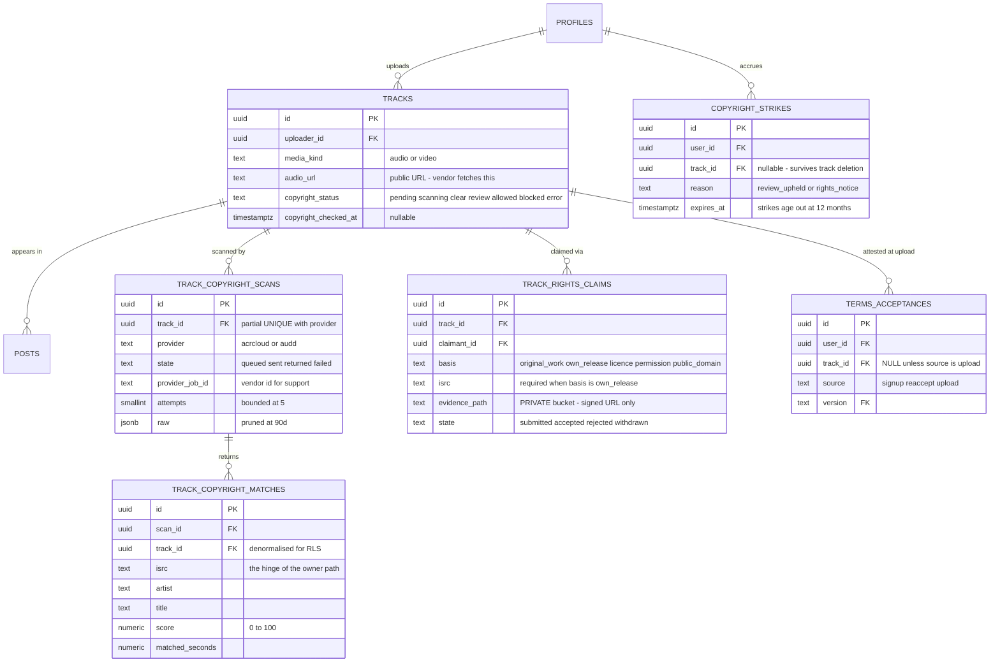
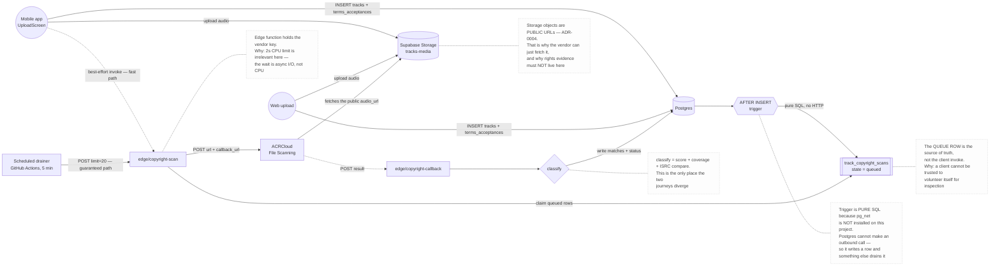
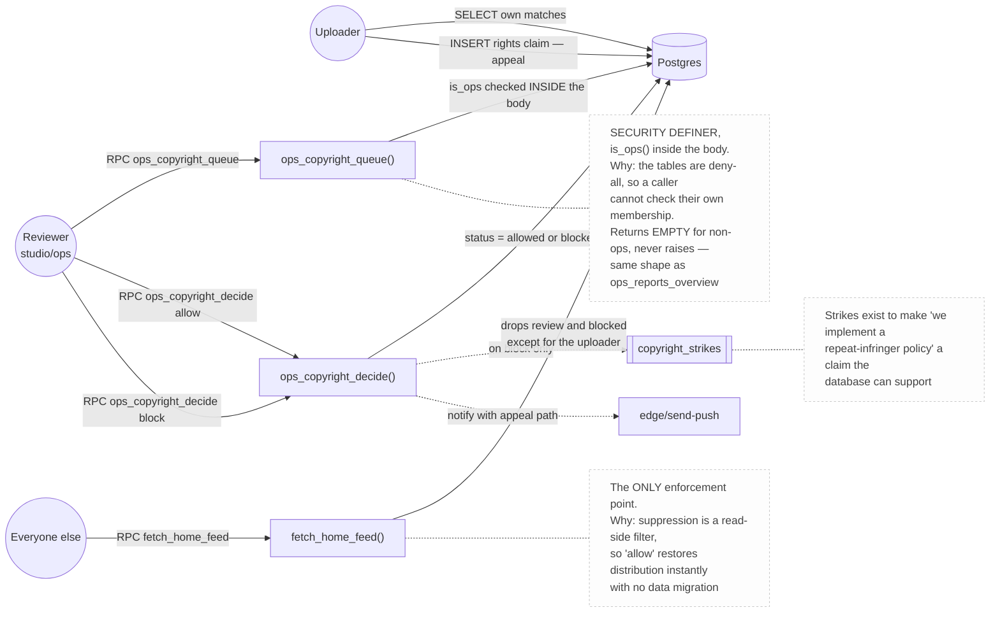
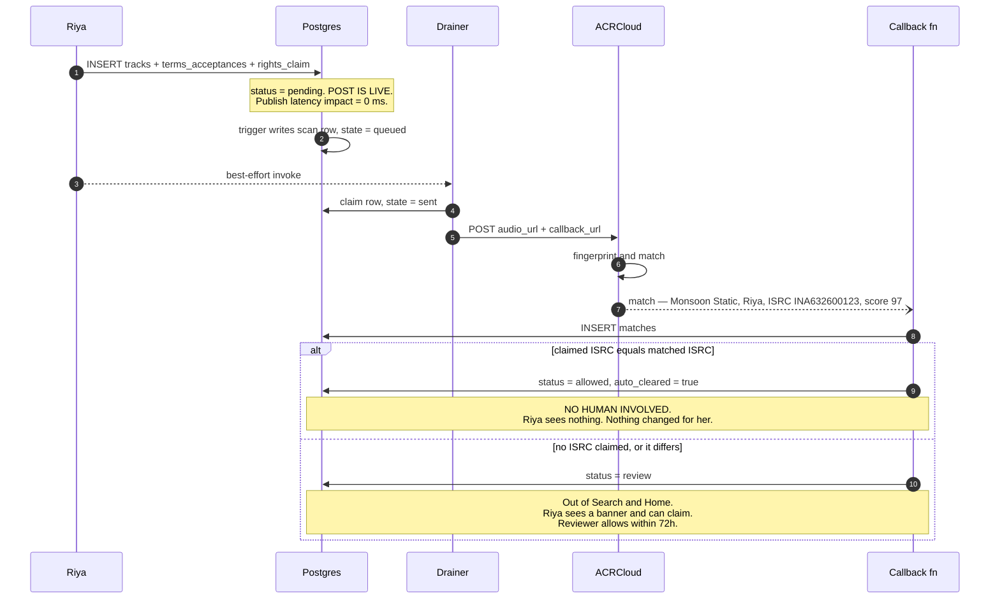
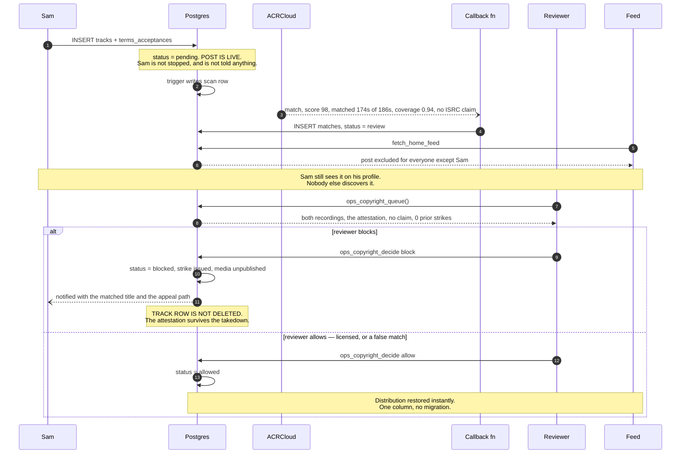
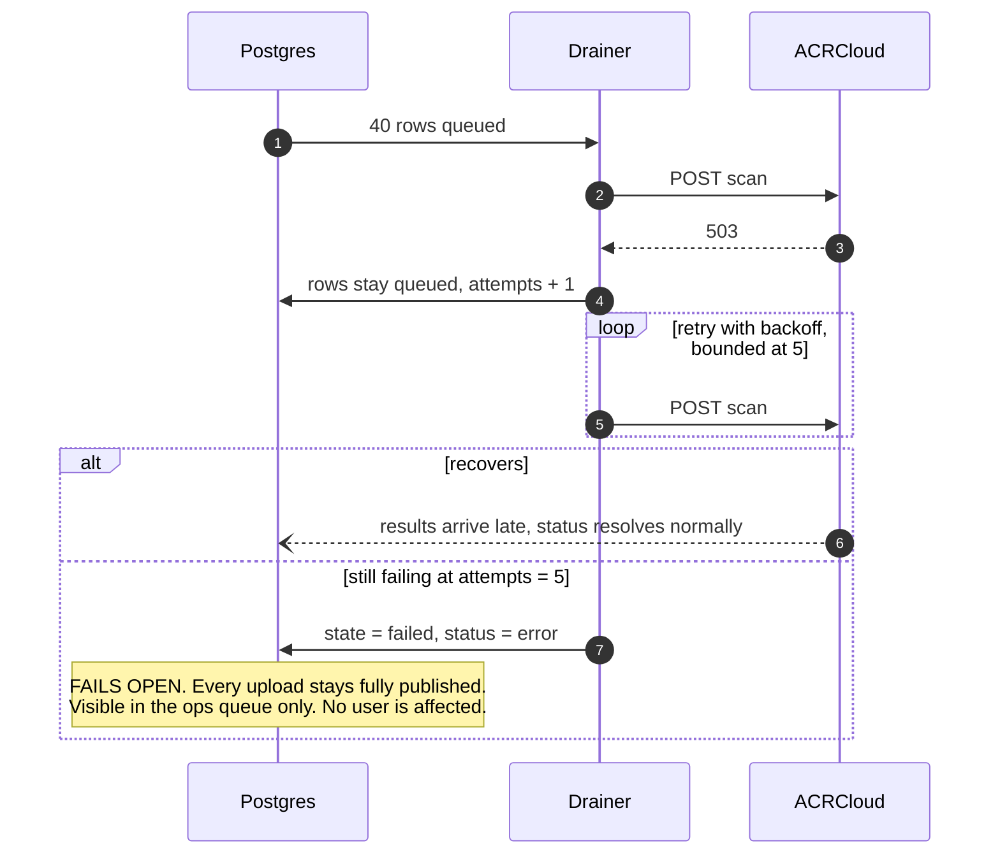

# Design: Copyright Risk Signal on Upload

> **In one line:** An asynchronous, fail-open classification pipeline hung off the existing
> upload path — the publish is never blocked, the signal lands ~40 s later, and the only actor
> that can suppress content is a human.

**Assumptions:** Livil is a solo-maintained React Native app on Supabase with **no API tier of
its own** (ADR-0004). This design is constrained by that, not free of it. The two journeys
below — *uploader owns the song* and *uploader does not* — are the same pipeline; what differs
is one comparison and who gets involved.

**Companion to** [PROP-0011](0011-copyright-risk-signal-on-upload.md), which carries the vendor
evaluation. This document is the mechanism.

| | |
|---|---|
| **Scale** | Uploads/day is **unmeasured** — see §2. Cost and load are linear in uploads, not users or plays |
| **Primary constraint** | Precision, not throughput. A false positive tells a musician their own song is stolen |
| **Key decision** | Advisory signal, asynchronous, **fails open**; ISRC self-claim auto-clears the owner path without a human |

---

## §1. Functional Requirements

> **Summary:** Scan every audio upload once, attach a status, let the owner prove ownership, let a human decide the rest. Never block a publish.

| # | Requirement | Priority |
|---|---|---|
| F1 | Every new audio upload is fingerprint-matched against a commercial recording database exactly once | Must |
| F2 | The uploader asserts, at upload time, that they have the right to share the file — recorded as evidence | Must |
| F3 | An uploader who owns a **released** recording supplies its ISRC and is cleared **without human involvement** | Must |
| F4 | A match with no ownership claim removes the post from discovery and raises a review item — it does **not** unpublish or delete | Must |
| F5 | A reviewer sees both recordings, the claim, and the uploader's history, and decides `allow` or `block` | Must |
| F6 | A `block` hides the post, records a strike, notifies the uploader, and exposes an appeal | Must |
| F7 | The uploader can always see their own status, the matched recording, and why | Must |
| F8 | Vendor failure leaves the upload fully published | Must |

**Out of scope:** video (passed to the vendor unchanged, no client-side decode); sample
clearance; monetisation and licensing; automatic account termination; formal DMCA
counter-notification; backfill of the existing catalogue (Phase 6, same pipeline, rate-limited).

> **Out loud —** *"F3 is the whole design, honestly. Everything else is plumbing you'd find in
> any moderation pipeline. On a music app the majority of matches are people uploading their
> own released music — they're supposed to match. If a human has to look at every one of those,
> the queue is 90% noise inside a week and the reviewer stops reading it. Comparing two ISRCs
> is the difference between a queue someone works and a queue someone ignores."*

---

## §2. Non-Functional Requirements

> **Summary:** Precision ≥ 0.95 is the gate. Publish latency must not move at all. Everything else is allowed to be slow.

| # | Requirement | Target | Why it shapes the design |
|---|---|---|---|
| N1 | Publish latency impact | **0 ms** | Forces the scan off the write path entirely — the enqueue is a SQL trigger, not an HTTP call |
| N2 | Precision on `review` | **≥ 0.95** | The expensive error is flagging a musician's own work. Gates the whole rollout |
| N3 | Recall on `review` | ≥ 0.70, secondary | A miss costs a notice later; a false flag costs a user now |
| N4 | Scan completion | p95 < 5 min, p99 < 30 min | Async; nobody waits on it |
| N5 | Review SLA | < 72 h in `review` | Discovery suppression is a real cost to a real person |
| N6 | Availability of scanning | **Best effort — fails open** | Vendor outage must never stop a publish |
| N7 | Consistency of status | Eventual | `pending` → terminal within N4. No read-your-writes requirement |
| N8 | Exactly-once scanning | Per `(track, provider)` | Duplicate scans are duplicate money. Enforced by a partial unique index, not by the caller |
| N9 | Raw vendor payload retention | 90 days | Enough to argue a dispute; not a permanent third-party data hoard |

**N6 is the highest-leverage line in this document.** Fail-open is what makes it safe to ship
a vendor dependency into the upload path of a live product.

### Capacity estimation

`kb/operations/scaling-assumptions.md` states plainly that **usage is unmeasured** and that an
agent must escalate rather than invent a threshold. So this is parameterised on `U` = audio
uploads/day rather than asserting a number.

```
Load          scans/day          = U           (F1: exactly once per track)
              peak scans/hour    = U/24 × 3    (diurnal factor 3)

U =    50  →     1.5k scans/month  →     ~6 peak/hour
U =   500  →      15k scans/month  →    ~63 peak/hour
U = 5,000  →     150k scans/month  →   ~625 peak/hour

                                   ⇒ even at U=5,000 this is SIX scans a minute.
                                     Throughput is not a problem at any plausible U.
                                     COST and PRECISION are the problems.

Storage       raw jsonb/scan     ≈ 5 KB
              matches/scan       ≈ 3 rows × 200 B = 600 B
              U = 500            → 2.8 MB/day → ~1 GB/year
              90-day pruning     → steady state ≈ 250 MB
                                   ⇒ storage never constrains anything

Egress        vendor fetches the file, average audio ≈ 8 MB
              U = 500            → 4 GB/day read out of tracks-media
                                   ⇒ watch the bucket egress bill, not the DB
```

### Cost shape — the number that actually decides the architecture

```
Per-recognition pricing (ACRCloud published rate ≈ US$0.0045/lookup)
  3 probe windows per track      = $0.0135 per upload
  U = 500 → 15,000 uploads/mo    = $202/month

Whole-file scanning (duration-priced; UNIT PRICE NOT PUBLIC — Phase 0 must confirm)
  cost = uploads × f(duration)   = unknown × 15,000

Break-even for moving fingerprinting on-device:
  on-device build cost  ≈ 3–5 days + a native rebuild + a new audio dependency
                          sitting beside the patched react-native-video
  worth it when         scanning bill > ~$100/month sustained
                        ⇒ roughly U > 250/day on per-recognition pricing
```

> **Out loud —** *"I want to be careful here, because inventing a traffic number for this repo
> is explicitly against its own rules — the scaling doc says usage is unmeasured and don't guess.
> So I'm parameterising on U. The useful thing that falls out anyway is the shape: this pipeline
> is never throughput-bound. Six scans a minute at five thousand uploads a day. If someone
> sketches Kafka on this whiteboard, they've misread which problem they have. The scarce
> resource is the reviewer's attention and the vendor invoice."*

---

## §3. Data Model

> **Summary:** One status column on the hot table, one queue, one result set, one claim, one strike ledger. No new store — all Postgres, because there is no second store and this doesn't justify inventing one.



| Table | Access pattern | Index |
|---|---|---|
| `tracks` | Feed and search filter on status | `(copyright_status, copyright_checked_at DESC) WHERE status IN ('review','error')` — partial, because the open set is the small set |
| `track_copyright_scans` | Drainer claims oldest queued | `(created_at) WHERE state = 'queued'` |
| `track_copyright_scans` | Exactly-once guard | `UNIQUE (track_id, provider) WHERE state <> 'failed'` |
| `track_copyright_matches` | Queue render, uploader read | `(track_id, score DESC)` |
| `track_rights_claims` | Queue join, uploader read | `(track_id)`, `(state) WHERE state = 'submitted'` |
| `copyright_strikes` | Reviewer sees history | `(user_id, issued_at DESC) WHERE expires_at > now()` |

**No partition or shard key.** One Postgres instance, one region, no replica (documented in
`kb/operations/scaling-assumptions.md` as a known cliff). At six scans a minute, proposing
sharding here would be architecture theatre.

> **Out loud —** *"The partial unique index on `(track_id, provider) WHERE state <> 'failed'` is
> doing the exactly-once work, and I want that in the database rather than in the drainer. If
> the guard lives in application code, two concurrent drainer runs both see 'no scan yet' and
> you pay the vendor twice. The database is the only thing that can actually serialise that —
> and in this repo it's the only enforcement layer there is, which the constitution says out
> loud in §16."*

---

## §4. API List

> **Summary:** There is no API tier. The "API" is PostgREST over RLS, three database functions, and two edge functions holding the one secret.

| Method | Surface | Purpose | Auth | Idempotent |
|---|---|---|---|---|
| `INSERT` | `tracks` (PostgREST) | Existing upload — **unchanged** | RLS: own row | No |
| `INSERT` | `terms_acceptances` (PostgREST) | Record the upload attestation | RLS: `user_id = auth.uid()` | Yes — unique `(user_id, version, track_id)` |
| `INSERT` | `track_rights_claims` (PostgREST) | Claim ownership or permission | RLS: own track | No |
| `SELECT` | `track_copyright_matches` (PostgREST) | "Why was I flagged?" | RLS: uploader of the track | Yes |
| `POST` | `edge/copyright-scan` | Drain the queue, call the vendor | Service key or cron secret | **Yes** — claims rows by state |
| `POST` | `edge/copyright-scan-callback` | Vendor delivers the result | Shared secret + job id must match a `sent` row | **Yes** — replay is a no-op |
| `RPC` | `ops_copyright_queue(bool)` | The review queue | `is_ops()`, checked **inside** the body | Yes |
| `RPC` | `ops_copyright_decide(uuid,text,text)` | Allow or block | `is_ops()` | Yes — decision is a state transition |
| `RPC` | `fetch_home_feed(...)` | **Modified** — drops `review`/`blocked` for other users | existing | Yes |

> **Out loud —** *"Notice there's no `POST /api/scan`. This repo deliberately has no service tier
> — clients talk to Postgres and row-level security is the entire authorization boundary. So I'm
> not going to draw a microservice diagram and pretend. The two edge functions exist for exactly
> one reason: something has to hold the vendor API key, and it can't be the phone."*

---

## §5. API Contracts

### `POST edge/copyright-scan` — drain the queue

**Auth:** `Authorization: Bearer <CRON_SECRET>`. Called by a scheduled job, and best-effort by
the client right after upload.

**Request**
```json
{ "limit": 20 }
```

**Response `200`**
```json
{
  "claimed": 3,
  "sent": 3,
  "failed": 0,
  "skipped_locked": 0
}
```

**Idempotency:** the drainer claims rows with a conditional write —
`UPDATE ... SET state='sent', attempts=attempts+1 WHERE state='queued' RETURNING *`. Two
concurrent runs cannot claim the same row; the loser sees zero rows, not an error. No
distributed lock, because the conditional write already is one.

| Status | Condition |
|---|---|
| `200` | Drained — body reports counts, including zero |
| `401` | Bad or missing cron secret |
| `503` | Vendor unreachable — rows stay `queued`, `attempts` incremented |

### `POST edge/copyright-scan-callback` — the vendor answers

**Auth:** `?token=<CALLBACK_SECRET>` **and** `provider_job_id` must resolve to a scan row in
state `sent`. Both, because the token is in a URL and URLs leak.

**Request** *(vendor-shaped; abridged)*
```json
{
  "file_id": "acr_88213f",
  "status": { "code": 0, "msg": "Success" },
  "results": [
    {
      "offset": 12.4,
      "duration": 176.2,
      "music": [{
        "title": "Monsoon Static",
        "artists": [{ "name": "Riya" }],
        "album": { "name": "Monsoon Static" },
        "label": "DistroKid",
        "score": 97,
        "external_ids": { "isrc": "INA632600123" },
        "play_offset_ms": 0
      }]
    }
  ]
}
```

**Response `200`** — `{ "ok": true }`. Always 200 on a recognised job, even for a zero-match
result: a vendor that receives a 4xx will retry, and a retry of a correct delivery is waste.

| Status | Condition |
|---|---|
| `200` | Recorded, or replay of an already-`returned` scan — no-op |
| `401` | Bad token |
| `404` | `file_id` matches no `sent` scan — **logged and dropped, never trusted** |

**Every string in that payload is untrusted third-party input** (Constitution §19, *trust
nothing that arrives from outside*). It is stored as data and escaped at render, exactly as
`web/api/share.ts` already escapes user-authored titles.

### `INSERT track_rights_claims` — the owner proves it

**Request** *(PostgREST)*
```json
{
  "track_id": "9f2c…",
  "basis": "own_release",
  "isrc": "INA632600123",
  "statement": "Released via DistroKid, 2026-03-11. I am the sole rights holder."
}
```

| Field | Type | Required | Constraint |
|---|---|---|---|
| `basis` | enum | yes | `original_work` · `own_release` · `licence` · `permission` · `public_domain` |
| `isrc` | string | **when `basis = 'own_release'`** | `^[A-Z]{2}[A-Z0-9]{3}[0-9]{7}$` |
| `statement` | string | no | ≤ 2000 chars |
| `evidence_path` | string | no | Object key in a **private** bucket. Never a public URL |

| Status | Condition |
|---|---|
| `201` | Claim recorded |
| `403` | RLS — not your track |
| `400` | ISRC fails the format check, or `own_release` with no ISRC |

> **Out loud —** *"The ISRC format regex is not security — an ISRC is twelve characters and
> anyone can type a plausible one. It's a typo filter. The actual strength of the auto-clear is
> that it has to **equal the one the vendor independently returned**, which you can't do by
> guessing. And it's recorded and revocable, so if someone does game it, the row is sitting there
> with their name on it."*

---

## §6. Architecture

### Upload & Scan Path — `INSERT tracks` / `edge/copyright-scan` / `edge/copyright-callback`



*Dashed = asynchronous. Everything downstream of the trigger can fail without touching the
publish — that is N1 and N6 drawn as a picture. The solid path from app to Postgres is the
existing upload, unchanged.*

### Review & Enforcement Path — `ops_copyright_queue` / `ops_copyright_decide` / `fetch_home_feed`



*Note what is **absent**: no delete, no storage mutation, no cascade. Enforcement is a read-side
filter over one column, which is what makes every decision instantly reversible.*

| Component | Why it exists | What if removed |
|---|---|---|
| SQL trigger | Enqueue without an outbound call — `pg_net` is not installed | Scanning depends on the client volunteering; a patched client skips it |
| Queue table | Survives a dropped client call, a cold edge function, a vendor outage | Lost scans, silently |
| Scheduled drainer | The guaranteed path behind the best-effort one | Queue fills; nothing notices |
| Edge functions | The only place the vendor key can live (Constitution §18) | Key on the phone — extractable from the APK |
| `classify` step | Where owner and non-owner diverge | Every match becomes a human's problem |
| Feed filter | The single enforcement point | Suppression would need row mutation, and reversal a migration |

---

## §7. Request Flows — the two journeys

### Journey A — **you own the song**

`@riya` uploads *Monsoon Static*, her own single, already distributed to Spotify under
`INA632600123`. At upload she picks basis `own_release` and pastes the ISRC.



**What Riya actually experiences:** her song posts instantly, appears in the feed instantly, and
about forty seconds later a row she will never see changes from `pending` to `allowed`.

The `else` branch is the honest cost of this design and is **the false-positive path**: a
released artist who doesn't supply an ISRC loses discovery for up to 72 hours. Mitigation is in
the form, not the pipeline — picking `own_release` makes the ISRC field required.

> **Out loud —** *"I want to be straight about that else branch, because it's where a demo would
> quietly cut away. If Riya skips the ISRC, my system tells her — a signed artist — that her own
> single needs review. That's the failure that loses you a user, not a missed Drake upload. It's
> why precision is the rollout gate and why shadow mode runs for a month before anyone sees a
> flag. If I couldn't get that number above 0.95, I'd ship nothing."*

### Journey B — **you don't own the song**

`@sam` uploads a commercial track and ticks the rights box anyway.



**What Sam actually experiences:** the upload succeeds and looks normal. His post sits on his
profile but never surfaces in Search or Home. Within 72 hours he is either left alone or told
which recording he matched, that his post is hidden, and how to appeal.

### Failure branch — the vendor is down



> **Out loud —** *"Fail-open is the call I'd defend hardest. The tempting design is to hold
> posts in a pending state until the scan returns, because it feels safer. It isn't — it means
> a vendor having a bad afternoon silently stops every musician on the platform from publishing,
> and nobody on my side finds out until the support mail arrives. I'll take the missed scan. The
> queue row is still there; it gets scanned when the vendor comes back."*

---

## §8. Tradeoffs & Bottlenecks

### Decisions

| Decision | Rejected alternative | What would flip it |
|---|---|---|
| **Advisory signal** | Auto-block on match | Never, for a music app — the owner path *is* a match. Would need a rights database we trust more than the user |
| **Async, post-publish** | Scan before publish | If precision hit ~0.99 *and* p95 scan dropped under ~5 s. Both are implausible with a URL-fetch vendor |
| **Fail-open** | Fail-closed | If Livil ever carried label licensing obligations with contractual filtering terms |
| **SQL trigger + drainer** | `pg_net` trigger calling the function directly | It's simply not installed on this project. Enable it and this gets simpler |
| **Vendor fetches our URL** | On-device fingerprinting | Scanning bill > ~$100/month sustained (≈ U > 250/day) |
| **ISRC self-claim auto-clear** | Human review of every match | If self-claim abuse appeared in the audit — the flag is recorded and revocable precisely so this is measurable |
| **Read-side suppression** | Unpublish the row on flag | Never — reversal would become a data migration instead of a column write |
| **Takedown = status change** | `DELETE` the track | Never. The `terms_acceptances` cascade would destroy the ownership attestation exactly when a dispute needs it |
| **One provider** | Two providers voting | When a rightsholder disputes a decision made on single-vendor data |

### What breaks first at 10×

| Order | Component | Breaks at | Fix |
|---|---|---|---|
| 1 | **The reviewer** | ~20 items/day — one person, 72 h SLA | Tighten thresholds; auto-allow more via ISRC; a second `ops_users` row |
| 2 | Vendor bill | Linear in uploads, superlinear in worry | Move fingerprinting on-device (break-even above) |
| 3 | Storage egress | Vendor fetches every file — U=5,000 → 40 GB/day | Send a fingerprint instead of a URL |
| 4 | Drainer window | 20 rows / 5 min = 5,760/day | Raise `limit`; it is one integer |
| 5 | Postgres | Not remotely — 6 inserts/minute at U=5,000 | — |

**The first bottleneck is a person, and that is not a joke.** Every other line on this table is
an integer somewhere. Queue volume is the only capacity number in this design that cannot be
fixed by editing a constant, which is why F3 — clearing the owner path without a human — is a
throughput decision, not a UX nicety.

### Failure modes

| Failure | Effect | Degradation | Blast radius |
|---|---|---|---|
| Vendor down | Scans queue up | **Fails open** — everything publishes | Zero users affected |
| Vendor wrong (false positive) | Owner flagged | Discovery lost ≤ 72 h | One user, high felt severity |
| Vendor wrong (false negative) | Infringing post lives | Same as today | Notice path catches it |
| Callback secret leaks | Forged results | Job id must match a `sent` row, so the forger must also guess a live scan | Bounded; rotate the secret |
| Drainer stops | Queue grows silently | Nothing publishes differently | **Needs an alert on queue age — the quietest failure here** |
| Edge function cold start | Slower scans | Async; invisible | None |
| Reviewer unavailable | Items age past SLA | Suppression persists | Proportional to inflow |
| Evidence bucket misconfigured public | Contracts world-readable | — | **Not reversible after exposure** |

> **Out loud —** *"If you ask me which of these actually happens, it's the drainer quietly
> stopping. Nothing breaks, no user complains, no alert fires, and three weeks later someone
> notices eleven thousand tracks sitting at `pending`. Any queue you build without an alert on
> its oldest item is a queue that will do this to you. The alert is the feature, not the queue."*

### Cost shape

```
Scanning       U × unit price     — unit price NOT PUBLIC. Phase 0 confirms it.
Egress         U × ~8 MB out of tracks-media, once per track, forever
Storage        ~250 MB steady state at U=500. Free.
Human          the real cost — one reviewer's attention, scaling with flag volume

The lever that matters is FLAG VOLUME, not scan volume. Scans are cents.
A 10% false-positive rate at U=500 is 50 people a day being told their
music is stolen, and one person reading 50 queue items. That is the
budget that breaks, and it breaks before the invoice does.
```

---

## §9. Gap Analysis — what exists today

> **Summary:** None of this exists. The upload path is real and unchanged; everything downstream of the trigger is new.

| Capability | Today | File | Gap |
|---|---|---|---|
| Audio upload | Works | `src/services/uploads.ts`, `src/services/tracks.ts:318` `createTrack` | None — this design does not touch it |
| Track row + status | No status column | `supabase/migrations/00000000000000_baseline_schema.sql:81` | Add `copyright_status`, `copyright_checked_at` |
| Client write guard | `tracks_update_own` is a **full-row** update policy | baseline schema `:295` | **A client could set its own `copyright_status`.** Must be narrowed or the column is decorative |
| Upload attestation | Deliberately unbuilt, with the TODO written into the migration | `supabase/migrations/20260907000000_terms_acceptance_log.sql` | Add `'upload'` source, `track_id`, the composite index |
| Ops review surface | Exists for reports only | `20260808120000_ops_reports_queue.sql`, `web/src/screens/Ops.tsx` | New RPC pair in the same shape; new tab |
| Ops identity | `is_ops()` works | `20260805000000_waitlist_ops_dashboard.sql:51` | Reuse as-is |
| Outbound HTTP from Postgres | **`pg_net` not installed** | noted in `20260806000000_waitlist_self_serve_invite.sql:11` | Why the trigger is pure SQL and a drainer exists |
| Scheduler | `pg_cron` available, **not installed**; and it cannot make HTTP calls anyway | `20260816030000_home_feed_candidates.sql:54` | External scheduler — GitHub Actions, or Vercel Cron if the account is on Pro |
| Edge functions | 4 exist, pattern established | `supabase/functions/` | Two more |
| Feed filter | No status awareness | `public.fetch_home_feed` | Add the exclusion, exempting the uploader |
| Private storage | All buckets public-read (ADR-0004) | `kb/decisions/0004-supabase-direct-no-api-tier.md` | **A private bucket must exist before any evidence upload ships** |

**Fair reading of the gaps:** nothing here is a defect in the current system. Livil has no
copyright detection because it was never built, not because something was done badly. The two
entries worth acting on independently of this proposal are the **full-row `tracks` update
policy** (any new server-owned column on `tracks` has this problem, not just this one) and the
**absence of a private bucket** (which blocks any feature that ever needs to store a document a
user shouldn't be able to hand around).

---

> **The fork not taken:** this designs the *platform's* view — detect, signal, review. The other
> reading is the *rightsholder's* view — a registry where labels claim recordings and Livil
> matches against it. That is a licensing product, not a moderation pipeline, and it is the Pex
> conversation recorded in PROP-0011 §Alternatives.
